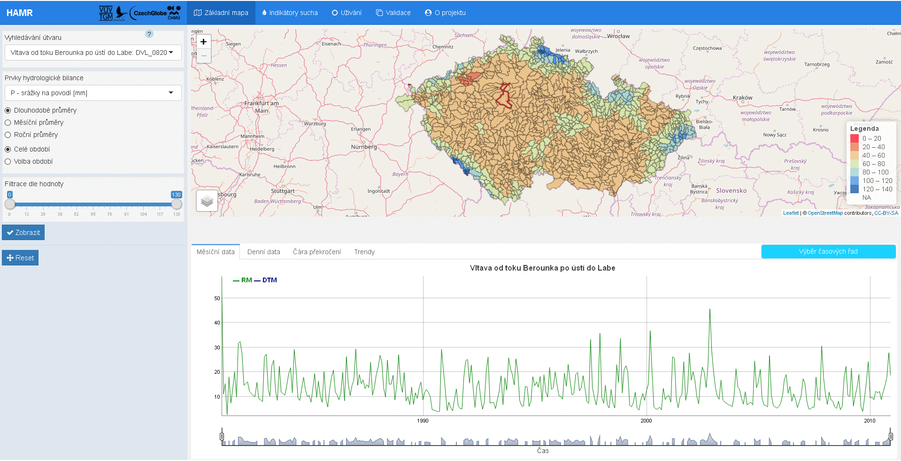
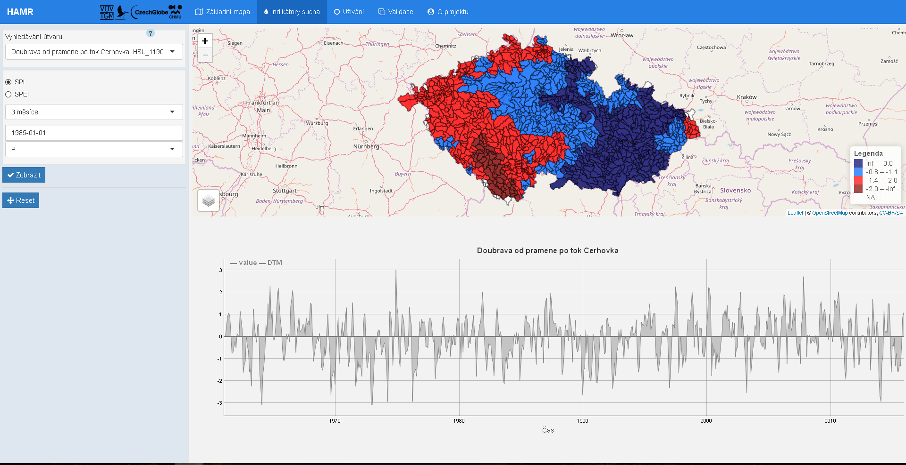
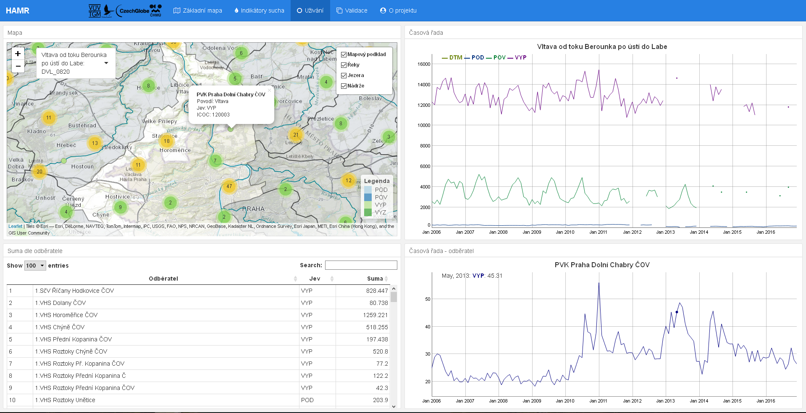
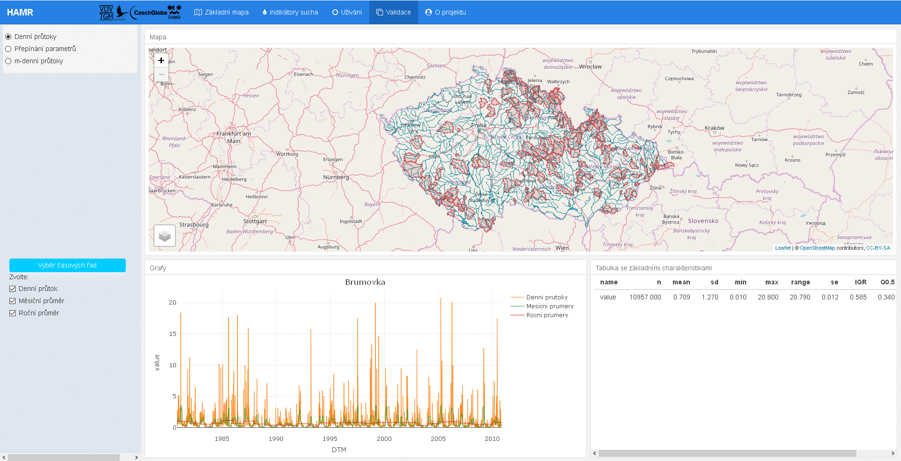
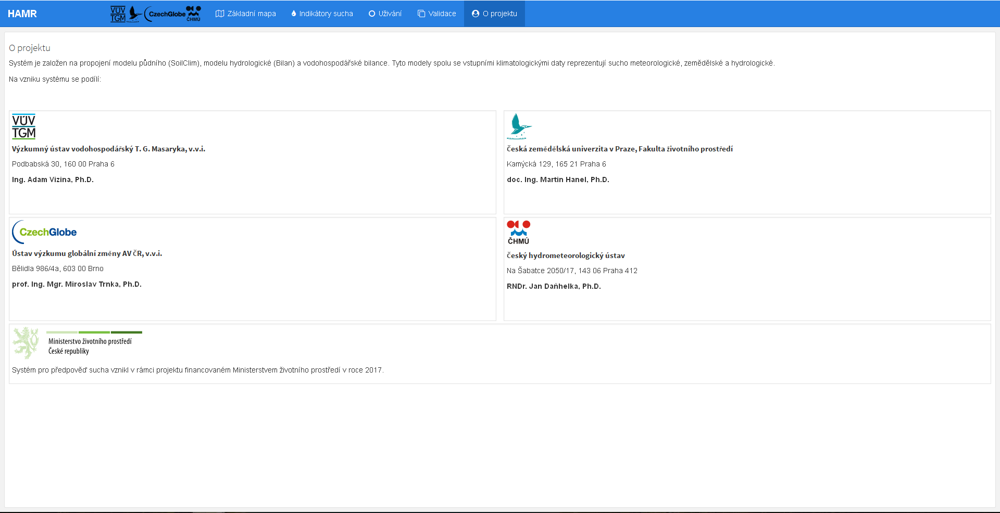

# Úvod

Aplikace je vytvořena prostřednictvím programovacího jazyka R. Jedná se o vizualizaci výsledků modelování projektu __*HAMR*__ (viz záložka "O projektu"). Jádro aplikace je postaveno na balíčcích `Shiny` a `flexdashboard`. 

`Shiny` umožňuje jednoduché vytváření webových aplikací, interaktivních vizualizací v prostředí R. Balíček `flexdashboard` je rozšířením `Shiny` a umožňuje pokročilé formátovaní vzhledu. Společně slouží k publikaci dat a jejích přehledné vizualizaci v rámci webového prohlížeče.

# Technické řešení 

Aplikace je přístupná na [serveru](https://shiny.fzp.czu.cz/KVHEM/HAMR/) nebo ji lze také [stáhnout](https://github.com/KVHEM/Sucho). Repositář na [github](https://github.com/) obsahuje následující soubory:

* soubor s aplikací "flex_app.Rmd"
* skript připravující vstupní data pro aplikací "prep.R"
* skript pro automatickou instalaci potřebných balíčku "install.packages.R"
* soubor s kaskádovými styly pro nastavení vzhledu aplikace "styles.css"

Mimo již zmíněné balíčky `Shiny` a `flexdashboard` byly použité následující balíčky:

* `leaflet`, umožňující vizualizaci prostorových dat v interaktivních mapách
* `ggplot2`, `dygraphs` k vykreslení časových řad a čar překročení
* `sp`, `rgeos` pro práci s prostorovými daty
* `data.table`, `dplyr` sloužící k transformaci dat

# Postprocessing

Na základě kalibrovaných parametrů modelu Bilan jsou vygenerovány denní časové řady odtoku a ostatních bilančních veličin pro období 1961-2015. Pro aplikaci jsou dále vygenerovány další datové produkty: 

* měsíční data - pro teplotu jsou průměry z denních hodnot, pro ostatní ukazatele jsou součty denních hodnot
* data pro čáru překročení - pochází z měsíčních dat, které jsou řazeny dle celého období, měsíců a sezon

Na základě evidence užívání vod, kterou spravuje VÚV T. G. M., jsou generovány měsíční časové řady pro období 2006-2016 a tabulky: 

* data pro časovou řadu za vybrané povodí jsou sumami jednotlivých odběratelů seskupenými podle jevů
* tabulka "Suma dle odběratele" obsahuje sumy za celé období za každého odběratele dle jevu

Aplikace pracuje s velkým množstvím dat, které se v rámci aplikace filtrují, agregují a průměrují. Pro snížení výpočetního času a náročnosti by bylo vhodné některé z těchto úkonů předpočítat a uložit jako datový soubor Rds. Téměř všechny výpočty mohou být předpočítany, ale implementace tohoto postupu proběhne v budoucnu. Je nutné nejdříve změřit a kvantifikovat rozdíl ve výkonu před a po implementaci. 

# Základní rozvržení

## Základní mapa

Okno prohlížeče je rozděleno do tří části: boční panel, panel s mapovým výstupem a panel s grafickými výstupy. 

V bočním panelu se nastavují vstupy pro vykreslení mapy. Volí se zde proměnná hydrologické bilance, podle níž budou zbarveny jednotlivá povodí zobrazené na mapě. Hodnoty jsou agregovány do měsíčních a ročních kroků, lze také vykreslit dlouhodobé průměry, tzn. průměry za celé období a za periody 1961-1990, 1971-2000 a 1981-2010.

Filtrace dle hodnoty v počátečním stavu obsahuje všechny hodnoty zvolené proměnné. Po nastavení rozsahu hodnot se vykreslí pouze povodí odpovídající požadavku. 

Vyhledávání útvaru je jedinou částí bočního panelu, která je propojená nejenom s mapou, ale i s grafickými výstupy. Pro zvolené povodí se vypočítají časové řady z měsíčních a denních dat a čára překročení pro celé období, roční období a měsíce (dlouhodobé charakteristiky). Zvolené povodí se zvýrazní v mapě červeným okrajem. Kliknutím na jiné povodí se přepočítají grafické výstupy a název nově zvoleného povodí s jeho UPOV_ID se promítne do pole "Vyhledávání útvaru". Toto pole lze také použít k ručnímu vyhledávání; stačí vymazat momentálně zobrazený název a začít psát název toku či jeho UPOV_ID.

Grafy mají vlastní výběr proměnných z prvků hydrologické bilance, který se nachází v pravém horním rohu grafického panelu.

Po nastavení údajů k vykreslení lze použít tlačítko "Zobrazit".

Tlačítko "Reset" vrací mapový panel na počátečně nastavené souřadnice

Mapový panel obsahuje základní vrstvy (jsou obsaženy v každém mapovém výstupu aplikace), jsou to vrstvy řek, jezer a nádrží a vrstva mapového podkladu. Vrstva povodí se zbarví dle nastavení v bočním panelu. Dále jsou k dispozici vrstvy administrativního členění ČR, vrstva povodí 3. řádu a vrstva horního povodí. Vrstva horního povodí zobrazuje pouze povodí přitékající do vybraného povodí.

V budoucnu bude umožněno přiblížení zvoleného polygonu a jemu odpovídacího okresu, kraje či oblasti povodí 3. řádu. Tento systém přibližování by pak měl být použít i u ostatních mapových výstupů v aplikaci.

Momentálně jsou v grafickém panelu u časových řad zobrazeny trendy pro celé pozorované období. V budoucnu budou grafické výstupy rozšířeny o záložku "Trendy", kde bude umožněna vizualizace trendů a vyhodnocení statistické významnosti pro vybrané období.

## Indikátory sucha 

Záložka indikátory sucha se skládá z bočního panelu, mapového panelu a grafického panelu. V bočním panelu si lze zvolit indikátor, krok, do kterého budou data agregována a datum. Momentálně v mapě je zobrazen indikátor SPI počítány klouzavě s krokem 1, 3, 6 a 12 měsíců. Časem budou přidány indikátory SPEI, PDSI, SGI, SRI a nedostatkové objemy ve stejném kroku. Povodí se rozdělují do 4 kategorií dle hodnot indexu:

+ 0 - bez výskytu sucha (-0,7 a vyšší)
+ 1 - slabé sucho (-0,8 až -1,3)
+ 2 - silné sucho (-1,4 až -1,9)
+ 3 - mimořádné sucho (- 2,0 a nižší) 

V grafický panelu se vykresluje časová řada indikátoru v konkretním povodí.

## Užívání

Záložka užívání je rozdělena do čtyř části: panel s mapovým výstupem, dva panely s grafickými výstupy a jeden panel s tabulkovým výstupem. 

Mapový panel obsahuje informace o užívání vody v ČR. Místa užívání se spojují do shluků. Po přiblížení lze na bod kliknout. Po kliknutí se zobrazí informace o odběrateli a jeho časová řada. Kliknutím na povodí je možno obdržet informace o všech odběratelích v tabulkovém panelu a časovou řadu pro jednotlivé jevy v grafickém panelu.

Podobně jako v záložce "Základní mapa" zde existuje panel s názvem povodí a jeho UPOV_ID, ve kterém lze nalézt požadovaná povodí. Tento panel lze přetáhnout na libovolné místo v rámci okna prohlížeče. 

## Validace

V současné verzi záložka "Validace" se dělí na dvě částí: mapový výstup denních průtoků/parametrů (lze přepnout v příslušném panelu) a grafický panel s časovou řadou zvoleného povodí (lze vykreslit v denním, měsíčním a ročním kroku pomocí panelu "Výběr časových řad").

V dalších verzích bude umožněno porovnání výstupu modelu s pozorováním:

* ve vodoměrných stanicích
* v profilech nádrží
* charakteristiky UPOVu (m-denni vody)
* plošné rozložení parametrů

## O projektu

Krátký popis projektu a veškeré kontakty.V budoucnu bude rozšířeno o metodiky k jednotlivým součástem systému.
