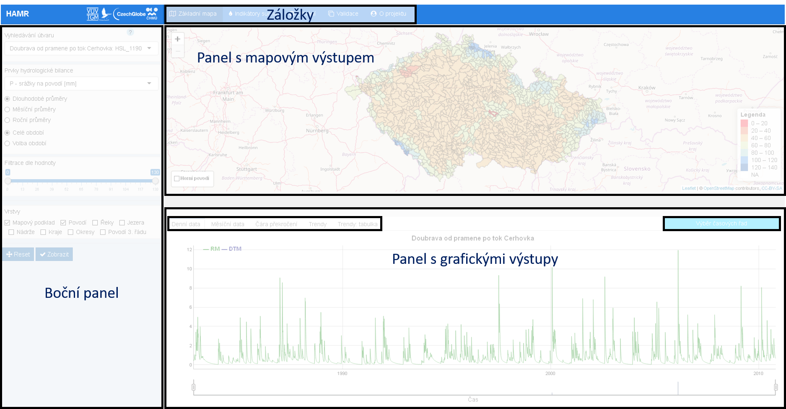
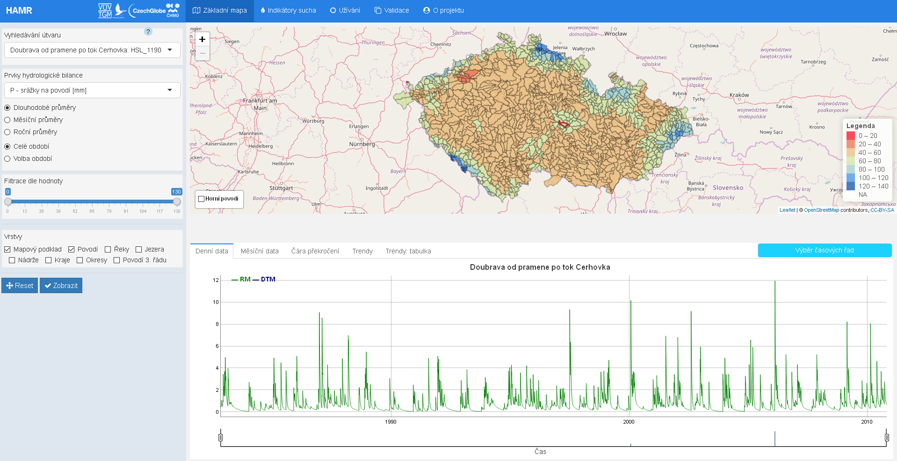
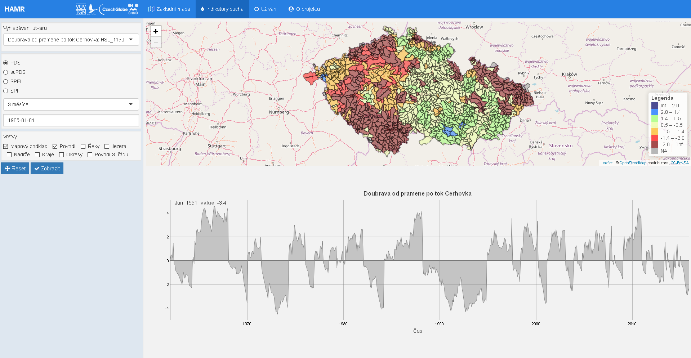
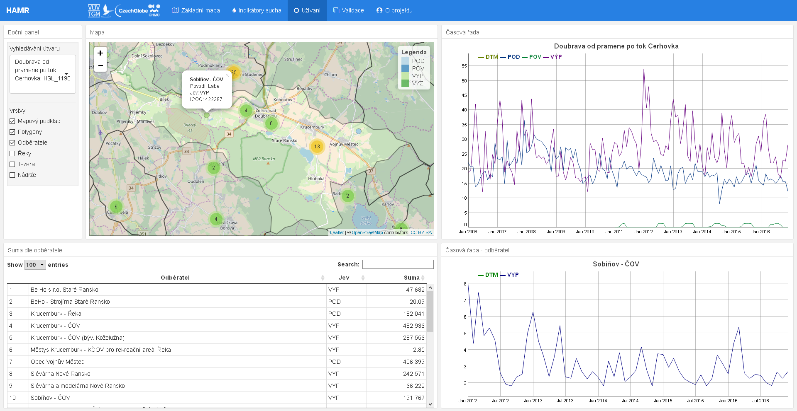
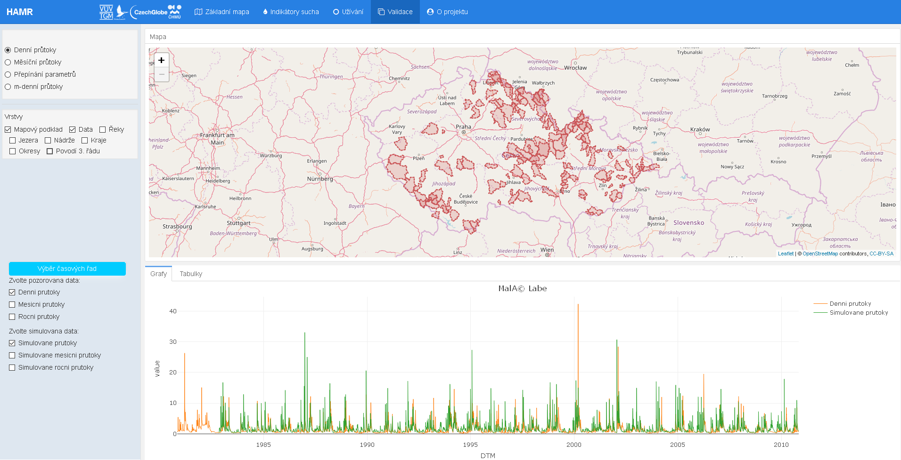

# Úvod

Aplikace je vytvořena prostřednictvím programovacího jazyka R. Jedná se o vizualizaci výsledků modelování projektu __*HAMR*__ (viz záložka "O projektu"). Jádro aplikace je postaveno na balíčcích `Shiny` a `flexdashboard`. 

`Shiny` je balíček, umožňující jednoduché vytváření interaktivních aplikací kombinací výpočetních možností R s interaktivitou moderních webových stránek. `flexdashboard` slouží k publikaci dat a jejích přehledné vizualizaci v rámci webového prohlížeče. Využívá `R Markdown` k publikaci souvisejících vizualizací do jednotného zobrazení neboli *dashboard*u. Balíček podporuje široký výběr komponentů, včetně `htmlwidgets` ( například `Leaflet`, `dygraphs`, `Plotly`). Společně tyto balíčky slouží k publikaci interaktivních vizualizací v rámci webového prohlížeče.

# Technické řešení 

Aplikace je přístupná na [serveru](https://shiny.fzp.czu.cz/KVHEM/HAMR/)^[Aplikace na serveru ČZU KVHEM: https://shiny.fzp.czu.cz/KVHEM/HAMR/] nebo ji lze také [stáhnout ze stránek GitHubu](https://github.com/KVHEM/Sucho)^[Repozitář na GitHub: https://github.com/KVHEM/Sucho], kde je pro aplikaci založen repozitář. Tento repozitář obsahuje následující soubory:

* Soubor s aplikací "flex_app.Rmd"
* Skript připravující vstupní data pro aplikací "prep.R"
* Skript pro automatickou instalaci potřebných balíčku "install.packages.R"
* Soubor s kaskádovými styly pro nastavení vzhledu aplikace "styles.css"

Mimo již zmíněné balíčky `Shiny` a `flexdashboard` byly použité následující balíčky:

* `Leaflet`, umožňující vizualizaci prostorových dat v interaktivních mapách
* `ggplot2`, `dygraphs` a `Plotly` k vykreslení časových řad a čar překročení
* `data.table`, `dplyr` sloužící k transformaci dat
* `DT`, sloužící k vytváření interaktivních tabulek.

# Data 

Data, která využívá aplikace jsou velká, přibližně 1.17 GB, a jsou chráněna licencí. Většinou se totiž jedná o majetek ČHMU a VÚV T.M.G. Z těchto důvodů data jsou zatím uložena zvlášť na OwnCloud^[OwnCloud je open source cloudová služba, více o této službě zde: https://owncloud.org/features/] úložišti, ke kterému mají přístup pouze řešitelé projektu. Pro offline chod aplikace je tedy nezbytné mít přístup na toto úložiště. Verze publikovaná na serveru KVHEM pochopitelně využívá vlastní kopii dat.

Vizualizovaná data lze rozdělit do několika skupin: prostorová data, data potřebná pro hydrologickou bilanci, data pro indikátory sucha, data pro užívání vod a data pro validaci. Skupina prostorových dat obsahuje soubory s informacemi o útvarech povrchových vod (UPOV) ČR (`povodi.rds`, `reky.rds`, `jezera.rds`, `nadrze.rds`) a soubory administrativního členění ČR (`kraje.rds`, `okresy.rds` a povodí 3. řadu `povodi_III.rds`). Tyto soubory byly v rámci přípravy dat převedeny z formátu .shp do formátu .rds. Dále pro rychlejší načítání a jednodušší manipulaci byly tyto soubory transformovány do souřadnicového systému WGS84 (pomocí funkce `spTransform()` z&nbsp;balíčku `sp` a atributu `CRS` - *Coordinate Reference System* - nastaveného na identifikátor pro WGS84 - EPSG:4326) a zjednodušeny (pomocí funkce `ms_simplify()` z balíčku `rmapshaper`) pro snížení náročnosti při vykreslování. Soubor `popis.rds` obsahuje informace o jednotlivých útvarech jako jsou název útvaru, název povodí, název oblasti, kategorie útvaru a typ útvaru. Následně soubor `popis.rds` je propojen pomocí funkce `merge()` z balíčku `sp` se souborem `povodi.rds` přes identy jednotlivých útvaru (`UPOV_ID`). K vykreslení horního povodí se používá soubor `TABB.rds` obsahující informace o tom, která povodí přitékají do jednotlivých UPOVů.

Další skupinou jsou data potřebná pro vyhodnocení hydrologické bilance. Pomocí modelu Bilan [@bilan] bylo v rámci projektu kalibrováno 1112 UPOVů a&nbsp;výstupem je 18 proměnných (složky hydrologické bilance a meteorologické vstupy) pro každý UPOV v denním kroku pro období 1981-2010. Tyto proměnné jsou uvedeny v tabulce níže [@bilan_man]:

|    zkratka   |            význam            |    zkratka    |                                          význam                                          |
|:------------:|:----------------------------:|:-------------:|:----------------------------------------------------------------------------------------:|
|  `P`  |       srážky na povodí       |  `SW`  | půdní vlhkost (zásoba  vody v nenasycené zóně)                                           |
|  `R`  |      odtok (pozorovaný)      |  `SS`  |                                   zásoba vody ve sněhu                                   |
|  `RM` |  celkový odtok (simulovaný)  |  `GS`  |                                   zásoba podzemní vody                                   |
|  `BF` |  základní odtok (simulovaný) |  `INF` |                                    infiltrace do půdy                                    |
|  `B`  |   základní odtok (odvozený)  | `PERC` |                                 perkolace z půdní vrstvy                                 |
|  `DS` |    zásoba pro přímý odtok    |  `RC`  |                                dotace zásoby podzemní vody                               |
|  `DR` |          přímý odtok         |   `T`  |                                      teplota vzduchu                                     |
| `PET` | potenciální evapotranspirace |   `H`  |                                      vlhkost vzduchu                                     |
|  `ET` |         územní výpar         |  `WEI` |                                 váhy pro kalibraci odtoku                                |

Z důvodů šetření vnitřní paměti aplikace se soubory s&nbsp;daty pro hydrologickou bilanci nacházejí na úložišti ve složce 'res' a jsou uloženy ve formátu .rds s názvy odpovídající identům jednotlivých povrchových útvarů (`UPOV_ID`). Aplikace tyto soubory načítá pouze při požadavku uživatele. Měsíční bilance je agregací denních dat a načítá se ze souboru `bilan_month_data_table.rds` (ukládá se do proměnné `BM`). Do teto skupiny lze zařadit i soubor `cara_prekroceni_dt.rds` (v&nbsp;aplikaci proměnná `cp`). Soubor obsahuje předpočítané roční, měsíční a sezónní pravděpodobnosti spočítané přes jednotlivé proměnné dle vzorce $p = \cfrac{(m-0.3)}{(n+0.4)}$, kde po seřazení souboru dle velikosti v klesajícím pořadí je $n$ počet prvků a $m$ je pořadové číslo.

Data pro vykreslení indikátorů sucha se nacházejí ve samostatné složce 'indikatory'. Při zvolení uživatelem indikátoru sucha (v nabídce jsou indikátory SPI, SPEI, PDSI a scPDSI spočítány klouzavě s krokem 1, 3, 6, 9 a 12 měsíců) se načte .rds soubor dle odpovídajícího indikátoru či indikátoru a kroku (u většich souborů). 

Data užívání vod za období 2006-2016 (`uzivani_na_nahraz_dt.rds` ve složce 'uzivani') pocházejí z evidence užívání vod, kterou spravuje VÚV T. G. Masaryka a v rámci aplikace se ukládají do proměnné `u`. Data obsahují informace o poloze odběru ve formě souřadnic (`X` a `Y`), identifikačním čísle odběru (`ICOC`), názvu místa odběru (`NAZICO`) a také informace o jevu (odběry z podzemních vod `POD`, odběry z povrchových vod `POV` či vypouštění `VYP`). V rámci přípravy dat byly `ICOC`ům, které obsahovali pozorované údaje, ale měli chybějící souřadnice, přiřazeny průměry souřadnic mezi odběry se stejným `ICOC` a jiným jevem. Tyto data slouží k vykreslení časových řad a tabulek. Pro vykreslení bodů do mapy bylo nutné vytvořit soubor (`u_leaflet.rds` ve stejné složce), který obsahuje pouze jeden záznam pro každý `ICOC`. Souřadnice těchto `ICOC`ů byly transformovány do souřadnicového systému WGS84 a&nbsp;následně byly uloženy ve formátu `SpatialPointsDataFrame`.

Kalibrace modelu Bilan proběhla s nastavením modelu na denní časový krok při použití šesti volných parametrů (*Spa*, *Alf*, *Dgm*, *Soc*, *Mec*, *Grd*). Parametry denního modelu Bilanjsou popsány v tabulce níže [@bilan_man]. Soubor s parametry `pars.rds` se nahrává v aplikaci do stejnojmenné proměnné a obsahuje počáteční hodnoty parametrů (`initial`), jejích dolní a horní meze (`lower`, `upper`) a stávající hodnotu (`current`). Tyto proměnné jsou dány pro každý UPOV. K stanovení hodnot parametrů byl použit globální optimalizační algoritmus diferenciální evoluce [@bilan_man].

|  název |                                                Alf                                               |                                                               Dgm                                                              |                        Grd                       |
|:------:|:------------------------------------------------------------------------------------------------:|:------------------------------------------------------------------------------------------------------------------------------:|:------------------------------------------------:|
| význam | parametr určující odtok ze zásoby pro přímý odtok                                               | koeficient mezi teplotou  a táním sněhu                                                                                        | parametr určující odtok ze zásoby  podzemní vody |
|  název |                                                Mec                                               |                                                               Soc                                                              |                        Spa                       |
| význam | parametr rozdělující perkolaci na přímý  odtok a na dotaci podzemní vody pro podmínky tání sněhu | koeficient mezi teplotou a táním parametr rozdělující perkolaci na  přímý odtok a na dotaci  podzemní vody pro letní  podmínky | kapacita zásoby půdní vlhkosti                   |

Model byl kalibrován na hydrologické charakteristiky povodí UPOV (m-denní průtoky a dlouhodobý průměrný průtok) poskytnuté ČHMÚ. M-denní průtoky vypočítané na základě pozorovaných hodnot lze načíst ze souboru `chars_mm.rds` a&nbsp;m-denní průtoky pro simulována data ze souboru `chars_mm_sim.rds`.

K validaci denních průtoků (soubor `QD.rds` ze složky 'chmu') bylo využito dat ze 156 vodoměrných stanic. Po propojení databankového čísla `DBCN` s povodím `UPOV_ID` zbylo 153 stanic. Mimo `DBCN` a `UPOV_ID` soubor obsahuje hodnoty pozorovaných denních průtoků (`value`) za období 1980-2010 (`DTM`). Simulované průtoky se nacházejí ve složce 'routed-0_bilan_bez_VN' a obdobně jako u denních dat hydrologické bilance obdrží se při zvolení konkrétní stanice (dle patřičného `UPOV_ID` aplikace načte odpovídající .rds soubor). Pro prostorové vykreslení stanic se používá soubor `QD_stanice` (složka 'geo_rds', soubor `stanice.rds`). Původní shapefile byl převeden do souřadnicového systému WGS84 a uložen ve formátu .rds. Soubor obsahuje nejen prostorové informace, ale i informace o názvech toku, ploše povodí atd. 

Validace měsíčních průtoků využívá záznamy 542 vodoměrných stanic z&nbsp;období 1982-2010. Prostorová data jsou uložená do proměnné `stanice` (soubor `E04_Vodomerne_stanice.rds` ze složky 'geo_rds'). Data s naměřenými (`QMER`) a simulovanými (`QNEX`, `QNEY`) průtoky lze načíst ze souboru `data_validace.rds` ze složky 'chmu'. Tento soubor byl vytvořen agregací denních dat ze složky 'routed-0_bilan_bez_VN'.

# Postprocessing

\qquad Pro podporu projektu byl vytvořen balíček `CatCa`^[Repozitář na GitHub: https://github.com/KVHEM/CatCa.], který obsahuje některé důležité funkce pro práci s útvary povrchových vod, výpočet bilance, m-denních vod atd. Nainstalovat balíček lze pomocí příkazu `devtools::install_github("KVHEM/CatCa")`. V rámci tvorby aplikace byly do tohoto balíčků přidány také funkce pro přípravu dat. Tyto funkce upravují vstupní data do potřebného formátu a vybírají pouze potřebné proměnné pro snížení využívané paměti a výpočetní náročností. Přehled funkcí k přípravě dat je úveden v tabulce níže. Dále balíček obsahuje funkci `give_paths()` pro nastavení pracovních cest k úložišti dat. Pokud cesta není nastavena pomocí funkce `give_paths()` je nutné jí uložit manuálně do proměnné `.datadir`. 

 `prep_spatial_data()`   | příprava prostorových dat pro aplikaci              
-------------------------|-----------------------------------------------------
 `prep_bilan_month()`    | příprava měsíční bilance pro aplikaci               
 `prep_QD()`             | příprava denních průtoku (validace) pro aplikaci    
 `prep_uzivani()`        | příprava užívaní pro aplikaci                       
 `prep_uzivani_upovid()` | příprava připojeni `UPOV_ID` k užívaní pro aplikaci 

# Základní rozvržení

Na úvod je vhodné uvést některé pojmy, které budou používány pro popis základního rozvržení aplikace. Okno aplikace je většinou rozděleno do několika hlavních části: boční panel, panel s mapovým výstupem a panel s grafickými výstupy. V bočním panelu se nastavují vstupy pro vykreslení mapy, požadované vrstvy a lze také použit pole pro vyhledávaní útvaru. Pole "Vyhledávaní útvaru" nabízí seznam všech vykreslených útvarů, ale lze ho také použít k ručnímu vyhledávání; stačí vymazat momentálně zobrazený název a napsat název toku či jeho `UPOV_ID`. Pole "Vrstvy" v bočním panelu je k dispozici pro každý panel s mapovým výstupem aplikace a&nbsp;umožňuje výběr následujících vrstev: povodí, řeky, jezera, nádrží, mapový podklad, povodí 3. řádu a administrativní členění České republiky (kraje a okresy). Boční panel některých záložek také obsahuje tlačítka "Reset" a "Zobrazit". Tlačítko "Reset" vrací mapový panel na počátečně nastavené souřadnice. Tlačítko "Zobrazit" slouží k&nbsp;vykreslení po novém nastavení vstupů. Horní lišta aplikace obsahuje přepínač mezi jednotlivými záložkami aplikace: "Základní mapa", "Indikátory sucha", "Užívání", "Výhledové užívání", "Validace" a "O projektu". Záložka "O projektu" obsahuje krátký popis projektu a&nbsp;veškeré kontakty. V budoucnu bude rozšířena o metodiky k jednotlivým součástem systému.

Grafy zpravidla mají vlastní výběr proměnných, který se na níže uvedeném obrázku nachází v pravém horním rohu grafického panelu. Tento výběr má tvar srolovatelného menu. Dále grafický panel může obsahovat vlastní lištu se záložkami pro přepínání mezi jednotlivými typy grafů a tabulek. 

## Základní mapa

\qquad "Základní mapa" je první záložkou a zobrazí se ihned po spuštění aplikace. Obsahuje informace o hydrologické bilanci povodí České republiky. Záložka základní mapa je rozložena na boční panel, panel s mapovým výstupem a panel s&nbsp;grafickým výstupem.  

\qquad V bočním panelu se nacházejí pole "Vyhledávání útvaru", "Prvky hydrologické bilance", "Filtrace dle hodnoty", "Vrstvy" a tlačítka "Reset" a "Zobrazit". Uživatel volí proměnnou hydrologické bilance, dle níž budou zbarveny jednotlivá povodí zobrazená na mapě. Hodnoty proměnné jsou agregovány do měsíčních a ročních kroků, lze je také vykreslit jako dlouhodobé průměry, tzn. průměry za celé období nebo za konkrétní periody po 29 letech: 1961-1990, 1971-2000 a 1981-2010. "Filtrace dle hodnoty" v počátečním stavu obsahuje všechny hodnoty zvolené proměnné a dále umožňuje nastavení rozsahu hodnot, který omezí vykreslená povodí. "Vyhledávání útvaru" je jedinou částí bočního panelu, která je propojená nejenom s mapou, ale i s grafickými výstupy. Mapové objekty jsou vykresleny pomocí `Leaflet`. Pro zvolené povodí se vypočítají časové řady z měsíčních a denních dat (pomocí balíčku `dygraphs`), čára překročení pro celé období, roční období a měsíce (pomocí balíčku `Plotly`) a trendy: grafické znázornění a tabulka s vyhodnocením statistické významnosti (`ggplot2`). Zvolené povodí se zvýrazní v mapě červeným okrajem. Kliknutím na jiné povodí se přepočítají grafické výstupy a název nově zvoleného povodí s jeho `UPOV_ID`  se promítne do pole "Vyhledávání útvaru".

## Indikátory sucha 

Záložka "Indikátory sucha" (obrázek \ref{fig:ch5.4}) se skládá z bočního panelu, mapového panelu a grafického panelu. V bočním panelu se obdobně jako v záložce "Základní mapa" nachází pole "Vyhledávání útvaru" a "Vrstvy". Dále v bočním panelu lze zvolit indikátor a krok, do kterého budou data agregována. Dále lze zvolit datum pro vykresleni mapy. Protože data mají měsíční časové měřítko, volba konkrétního dne v kalendáře nehraje pro vykreslení žádnou roli, ale volba data ve formátu "`mm-YYYY`" zatím není možná.  Momentálně v mapě jsou zobrazeny indikátory SPI (*Standardized Precipitation Index*), SPEI (*Standardized Precipitation Evapotranspiration Index*) a PDSI (*Palmer Drought Severity Index*) a scPDSI (*Self-calibrating Palmer Drought Severity Index*), které jsou počítány klouzavě s krokem 1, 3, 6, 9 a 12 měsíců. Povodí se dělí do 7 kategorií podle hodnoty příslušného indikátoru tak, aby se dostatečně projevila variabilita:

|  $\infty$ až $2,0$  |   extrémně vlhké  |
|:-------------------:|:-----------------:|
|    $2,0$ až $1,4$   |    silně vlhké    |
|    $1,4$ až $0,5$   |    mírně vlhké    |
|   $0,5$ až $-0,5$   | bez výskytu sucha |
|   $-0,5$ až $-1,4$  |    slabé sucho    |
|   $-1,4$ až $-2,0$  |    silné sucho    |
| $-2,0$ až $-\infty$ |  mimořádné sucho  |

Mapové objekty jsou vykresleny pomocí `Leaflet`. V grafický panelu se vykresluje časová řada indikátoru pro zvolené povodí pomocí baličku `dygraphs`.

## Užívání

Záložka "Užívání" obsahuje informace o užívání vody v ČR a&nbsp;je rozdělena do pěti části: boční panel, panel s mapovým výstupem, dva panely s&nbsp;grafickými výstupy a jeden panel s tabulkovým výstupem. Boční panel obsahuje pole "Vyhledávání útvaru" a "Vrstvy". Pole "Vrstvy" je rozšířeno o vrstvu "Odběratele", avšak postrádá administrativní členění České republiky. Mapový panel spojuje místa odběru do shluků. Po přiblížení lze na bod kliknout. Po kliknutí se zobrazí popisek s informací o odběrateli a vykreslí se časová řada odběrů. Kliknutím na povodí se obdrží informace o všech odběratelích v tabulkovém panelu a&nbsp;časová řada pro jednotlivé jevy v grafickém panelu (odběry z podzemních vod `POD`, odběry z povrchových vod `POV` či vypouštění `VYP`). Grafické panely jsou vytvořený pomocí `dygraphs`. Tabulka je vytvořená pomocí balíčku `DT` a je interaktivní.

## Validace

Záložka "Validace" se dělí na tří částí: boční panel, panel s mapovým výstupem a panel s grafickými výstupem. Boční panel obsahuje standardní pole "Vrstvy" a přepínač mezi následujícími možnostmi: denní průtoky, měsíční průtoky, přepínání parametrů a m-denní průtoky. 

Mapový výstup denních průtoků obsahuje polohu 153 měrných stanic a grafický panel po zvolení konkrétní měrné stanice vytvoří časovou řadou pozorovaných a simulovaných průtoků, které lze vykreslit v denním, měsíčním a&nbsp;ročním kroku pomocí menu "Výběr časových řad" (nachází se v oblastí bočního panelu). Záložku grafického panelu lze přepnout z grafů na tabulky, které nejsou interaktivní. Tabulka denních průtoků obsahuje pouze základní přehled o datech (počet pozorování, střední hodnotu atd.).

Mapový výstup měsíčních průtoků obsahuje pozice 542 vodoměrných stanic. Body vodoměrných stanic jsou propojeny s informacemi o UPOVu, do kterého spadají. Kliknutím na bod se objeví popisek stanice a vykreslí se horní povodí, obdobně jako v záložce "Základní mapa". Graf obsahuje časové řady pozorovaných a&nbsp;simulovaných průtoků a tabulka obsahuje číselné vyhodnocení přesností simulovaných dat vůči pozorovaným datům. Výpočet je uskutečněn pomocí funkce `gof()` z balíčku `hydroGOR`^[Dokumentace balíčku je dostupná na adrese https://cran.r-project.org/web/packages/hydroGOF/hydroGOF.pdf].   

Po zvolení "Přepínání parametrů" se v bočním panelu objeví pole s nabídkou parametrů (*Spa*, *Alf*, *Dgm*, *Soc*, *Mec*, *Grd*). Momentálně "Přepínání parametrů" obsahuje pouze panel s mapovým výstupem pro vizualizaci plošného rozložení parametrů. UPOVy jsou zbarveny dle stávajících hodnot parametru (`current`). 

Po zvolení m-denních průtoků se objeví v bočním panelu nabídka m-denních vod ($Q30d$, $Q60d$, $Q90d$, $Q120d$, $Q150d$, $Q180d$, $Q210d$, $Q240d$, $Q270d$, $Q300d$, $Q330d$, $Q355d$, $Q364d$). Také se objeví pole "Vyhledávání útvaru", které propojuje mapový a&nbsp;grafický panel. Útvary mapového výstupu se zbarvují dle hodnoty proměnné, kterou zvolí uživatel. Grafickým výstupem je `Plotly` objekt, který obsahuje seřazené hodnoty pozorovaných a simulovaných m-denních průtoků pro zvolené povodí. Tabulkový výstup obsahuje tytéž hodnoty.

