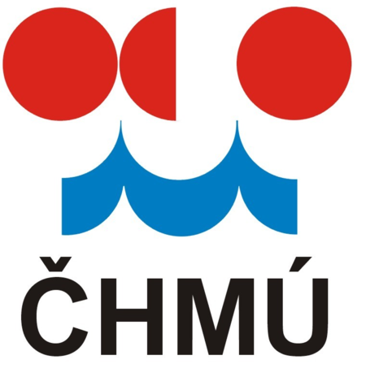
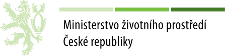

```{r global, include=FALSE}

library(shiny)
library(flexdashboard)
library(leaflet)
library(dplyr)
library(dygraphs)
library(ggplot2)
#library(gridExtra)
library(data.table)
#library(sp)
#library(rgeos)
#library(datasets)
#library(psych)
library(plotly)
library(DT) # An R interface to the DataTables library
library(parallel) #Parallel detectCores() error
library(rhandsontable)
#devtools::install_github("KVHEM/CatCa")
# install.packages("C:/Users/Irina/ownCloud/Shared/BILAN_UPOV/bilan/bilan_2016-10-20.zip",repos=NULL, type="source")
# library(bilan)

CatCa::give_paths()

BM <- readRDS(file.path(.datadir, "webapp_data/mbilan/bilan_month_data_table.rds"))

povodi <- readRDS(file.path(.datadir, "webapp_data/geo_rds/povodi.rds"))
reky <- readRDS(file.path(.datadir, "webapp_data/geo_rds/reky.rds"))
jezera <- readRDS(file.path(.datadir, "webapp_data/geo_rds/jezera.rds"))
nadrze <- readRDS(file.path(.datadir, "webapp_data/geo_rds/nadrze.rds"))
kraje <- readRDS(file.path(.datadir, "webapp_data/geo_rds/kraje.rds"))
okresy <- readRDS(file.path(.datadir, "webapp_data/geo_rds/okresy.rds"))
povodi_III <- readRDS(file.path(.datadir, "webapp_data/geo_rds/povodi_III.rds"))
stanice <- readRDS(file.path(.datadir, "webapp_data/geo_rds/stanice.rds"))
tabB <- readRDS(file.path(.datadir, "routing/TABB.rds"))
cp <- readRDS(file.path(.datadir, "webapp_data/to_from/cara_prekroceni_dt.rds"))

popis <- readRDS(file.path(.datadir, "webapp_data/popis.rds"))

pars <- readRDS(file.path(.datadir, "webapp_data/pars/pars.rds"))
u <- readRDS(file.path(.datadir, "webapp_data/uzivani/06_16/uzivani_na_nahraz_dt.rds"))
u_leaflet <- readRDS(file.path(.datadir, "webapp_data/uzivani/u_leaflet.rds"))
QD <- readRDS(file.path(.datadir, "webapp_data/chmu/QD.rds"))
chars <- readRDS(file.path(.datadir, "webapp_data/chmu/chars_mm.rds"))
spi <- readRDS(file.path(.datadir, "webapp_data/indikatory/spi.rds"))
spei <- readRDS(file.path(.datadir, "webapp_data/indikatory/spei.rds"))

# Merging data----------------
povodi <- sp::merge(povodi, popis, by='UPOV_ID')

search.choices <- as.character(povodi$UPOV_ID)
names(search.choices) <- paste(povodi$NAZ_UTVAR, search.choices, sep = ": ")

choices <- c("P" , "R", "RM", "BF", "B", "DS", "PET", "ET","SW", "SS", "GS", "INF", "PERC", "RC", "T", "H", "WEI")
names(choices) <- c(
'P - srážky na povodí [mm]',
'R - odtok (pozorovaný) [mm]',
'RM - celkovy odtok (simulovaný) [mm]',
'BF - základní odtok (simulovaný) [mm]',
'B - základní odtok (odvozený) [mm]',
'DS - zásoba pro přímý odtok [mm]',
'PET - potenciální evapotranspirace [mm]',
'ET - územní výpar [mm]',
'SW - půdní vlhkost (zásoba vody v nenasycené zóně) [mm]',
'SS - zásoba vody ve sněhu [mm]',
'GS - zásoba podzemní vody [mm]',
'INF - infiltrace do půdy [mm]',
'PERC - perkolace z půdní vrstvy [mm]',
'RC - dotace zásoby podzemní vody [mm]',
'T - teplota vzduchu [°C]',
'H - vlhkost vzduchu [%]',
'WEI - váhy pro kalibraci odtoku [-]')

choices2 <- c("P", "RM", "BF", "DS", "PET", "ET","SW")
names(choices2) <- c(
'P - srážky na povodí [mm]',
'RM - celkovy odtok (simulovaný) [mm]',
'BF - základní odtok (simulovaný) [mm]',
'DS - zásoba pro přímý odtok [mm]',
'PET - potenciální evapotranspirace [mm]',
'ET - územní výpar [mm]',
'SW - půdní vlhkost (zásoba vody v nenasycené zóně) [mm]')

choices3 <- c("value", "mean_month", "mean_year")
names(choices3) <- c("Denní průtok", "Měsiční průměr", "Roční průměr")

choices.pars <- as.character(unique(pars$name))

choices.mday <- c( "Qa", "Q30d", "Q60d", "Q90d", "Q120d", "Q150d", "Q180d", "Q210d", 
                  "Q240d", "Q270d", "Q300d", "Q330d", "Q355d", "Q364d")

mesice <- c("Leden","Únor","Březen","Duben","Květen","Červen",
            "Červenec","Srpen","Září","Říjen","Listopad","Prosinec")

#knitr::opts_chunk(cache.path='/home/owc/-hanel/KVHEM/-projekty/2017 SUCHO/Sucho/.ch/')
```

Základní mapa {data-icon="fa-map-o"}
===================================== 

Column {.sidebar data-width=400}
-----------------------------------------------------------------------

```{r ZM sidebar}

#Inputs--------------------

#
renderUI({
  wellPanel(
      HTML('<div class="help-tip">
           <p>Vyhledat můžete jak dle názvu, tak dle UPOV_ID.</p>
            </div>'),
      selectizeInput(inputId = "search.id","Vyhledávání útvaru",
                           selected=input$map_shape_click$id,
                           choices = search.choices)
  )
      })

wellPanel(HTML('<div class="help-tip">
               <p>Zvolte proměnnou, kterou chcete zobrazit a nastavte období.
               </p></div>'),
  selectInput("entry.variable", label="Prvky hydrologické bilance",
              choices = choices, selected = "P"), 
  
  radioButtons("kartogram", label=NULL, choices = c("Dlouhodobé průměry" = "A", 
             "Měsíční průměry" = "B", "Roční průměry" = "C"),
             selected = "A"),

  conditionalPanel(condition = "input.kartogram == 'A'",
               radioButtons("DP", label=NULL, selected = "DP1",
                                      choices = c("Celé období" = "DP1", "Volba období" = "DP2")),
                      conditionalPanel(condition = "input.DP == 'DP1'"),
                      conditionalPanel(condition = "input.DP == 'DP2'",
                                  selectInput("entry.period", label = NULL,
                                              choices = list("1961-1990" = "1", "1971-2000" = "2",
                                                            "1981 - 2010" = "3"), selected = "1")
                                  )
               ),
  conditionalPanel(condition = "input.kartogram == 'B'",
                  
                 dateInput("entry.date", label = NULL, "yyyy-mm-dd", language = "cs",
                           value = as.Date("1961-01-01"), startview = "decade",
                           min = as.Date("1961-01-01"), max = as.Date("2015-12-01"))
                 ),
  conditionalPanel(condition = "input.kartogram == 'C'",
            
                 selectInput("entry.yearC", label = "Zvolte rok:",
                             choices = seq(1961,2015,1))
                 )
  )


  renderUI({
    wellPanel(
      HTML('<div class="help-tip">
            <p>Tady nastavte rozsah hodnot.</p>
            </div>'),
      sliderInput("entry.range", label = "Filtrace dle hodnoty",
                  min = floor(reac()$def_min), 
                  max = ceiling(reac()$def_max),
                  value = c(floor(reac()$inputed_min),
                            ceiling(reac()$inputed_max)))
    )
            })
  
  hr()
  
  wellPanel(checkboxGroupInput("entry.layer", label = "Vrstvy",
    choices = c("Mapový podklad" = "MP", "Povodí" ="P", "Řeky" = "R", "Jezera" = "J", 
                "Nádrže" = "N", "Kraje" = "K", "Okresy" = "O", "Povodí 3. řádu" = "P3"), 
    selected = c("MP", "P"),
    inline = T))
  
  hr()

#         HTML('<button data-toggle="collapse" data-target="#box3" class="btn-block btn-primary">Filtování dle hodnoty</button>'),
#         tags$div()

div(style="display:inline-block",
    actionButton("reset_button", "Reset", icon("arrows"),
                 style="color: #fff; background-color: #337ab7; border-color: #2e6da4"),
    actionButton("go1", "Zobrazit", icon("check"),
                 style="color: #fff; background-color: #337ab7; border-color: #2e6da4")
)
  


```

```{r ZM Reactions}

#help-------------------------
#default.shape <- function(){return("DUN_0010")}
#input<-c()
#input$entry.variable = "P"
#input$entry.year = 1968
#input$entry.month = 2
#input$entry.number = 15
# input$entry.layer <- c("P")

#Reactions--------------------
reac<- eventReactive(input$go1,{ 
 
  vrstvy <- input$entry.layer

  bilance <-  BM[variable == input$entry.variable]
  
  bilance_filtr <- c()
  dta <- c()

#Dlouhodobé průměry (celé období/vybrané období)
  if(input$kartogram == "A"){
  if(input$DP == "DP1"){
    bilance_filtr <- bilance[year==2000 & month==1]
    colnames(bilance_filtr)[colnames(bilance_filtr)=="value"] <- "monthly.avg"
        colnames(bilance_filtr)[colnames(bilance_filtr)=="mean_ep"] <- "value"
    dta <- (sp::merge(povodi,bilance_filtr, by="UPOV_ID"))
  }else if(input$DP == "DP2"){
        if(input$entry.period == "1"){period=seq(1961,1990,1)
        }else if(input$entry.period == "2"){period = seq(1971,2000,1) 
        }else if(input$entry.period == "3"){period = seq(1981,2010,1)}
       bilance_filtr <- bilance[year %in% period] %>% group_by(UPOV_ID) %>% summarise(mean.period = mean(value))
       colnames(bilance_filtr)[colnames(bilance_filtr)=="value"] <- "monthly.avg"
       colnames(bilance_filtr)[colnames(bilance_filtr)=="mean.period"] <- "value"
       dta <- (sp::merge(povodi,bilance_filtr, by="UPOV_ID"))
#Měsíční průměry
  }}else if(input$kartogram == "B"){
    bilance_filtr <- bilance[year == year(input$entry.date) & month==month(input$entry.date)]
    dta <- (sp::merge(povodi,bilance_filtr, by="UPOV_ID"))
#Roční průměry
  }else if(input$kartogram == "C"){
    bilance_filtr <- bilance[year==input$entry.yearC & month==1]
    colnames(bilance_filtr)[colnames(bilance_filtr)=="value"] <- "monthly.avg"
    colnames(bilance_filtr)[colnames(bilance_filtr)=="annual.avg"] <- "value"
    dta <- (sp::merge(povodi,bilance_filtr, by="UPOV_ID"))}
  
#Minima a maxima pro filtraci dle hodnoty  
  def_min = min(dta$value, na.rm = T)
  def_max = max(dta$value, na.rm = T)
  
  inputed_min = def_min
  inputed_max = def_max
  
  if(!is.null(input$entry.range[1])){
  if(input$entry.range[1] != def_min){
    inputed_min = input$entry.range[1]}

  if(input$entry.range[2] != def_max){
    inputed_max = input$entry.range[2]}
  }
  
  dta <- base::subset(dta, (value >= inputed_min & value <= inputed_max) | is.na(value))
  
#Vytvaření palet
  mojePaleta <- c("#f90012", "#e5734a", "#e8da89", "#b3eab3", "#3a96f2", "#0046a2")

  if(input$entry.variable == "T"){
        pal <- colorBin(mojePaleta, domain = dta$value, pretty = TRUE, reverse = TRUE,  na.color = "#ffffff")

  }else{pal <- colorBin(mojePaleta, domain = dta$value, pretty = TRUE, na.color = "#ffffff")} 
  
  
  
  return(list(bilance=bilance_filtr, dta=dta, pal = pal, inputed_min=inputed_min, inputed_max=inputed_max,
              def_min=def_min, def_max=def_max, vrstvy = vrstvy))
}, ignoreNULL = FALSE, ignoreInit = FALSE)


```

```{r loga, include=FALSE}
absolutePanel(id = "logos", fixed = TRUE,
                  draggable = FALSE, top = "auto", left = "auto", right = "auto", bottom = 10,
                  width = 400,
                  style = "opacity: 1;",
           HTML(''),
           HTML(''),
           HTML(''),
           HTML(''))
```

Row 
-------------------------------------


```{r ZM mapa}
#Functions--------------------

title.f <- reactive({
  title<- popis$NAZ_UTVAR[popis$UPOV_ID == default.shape()]
  return(title)
  })

default.shape <- reactive({
  UPOV_ID.sel <- input$search.id
  return(UPOV_ID.sel)})

  initial_lat = 49.7437572
  initial_lng = 15.3386383
  initial_zoom = 7


#Outputs


  
#Leaflet--------------------

output$map<-renderLeaflet({


  

    reac_app <- reac()
    dta <- reac_app$dta
    pal <- reac_app$pal
    vrstvy <- reac_app$vrstvy

  # Creating labels--------------------

    labels <- sprintf(
      "<strong>%s</strong><br/>Kategorie: %s<br/>Stav: %s <br/> UPOV_ID: %s <br/> Hodnota: %s",
      dta$NAZ_UTVAR, dta$KTG_UPOV, dta$U_PMU, dta$UPOV_ID, round(dta$value,2)
      ) %>% lapply(htmltools::HTML)


   if(length(labels)==0){labels <- c(" ")}
  
 #ZM
    map <- leaflet() %>% 
       setView(lat = initial_lat, lng = initial_lng, zoom = initial_zoom)
      
 
 #Zbarvení povodí dle hodnoty + Legenda
 
    
    if("P" %in% vrstvy){
map <-  map %>% addPolygons(data=dta, layerId = dta$UPOV_ID, color = "burlywood4",
                             weight = 1.3, opacity = 0.3, smoothFactor = 0,
                             fillColor = ~pal(value), fillOpacity = 0.8,
                             group = "Povodí",
                 highlightOptions = highlightOptions(color = "#a53333",
                                                     opacity = 1,
                                                     fillOpacity = 0,
                                                     weight = 2.3,
                                                     bringToFront = TRUE, sendToBack = TRUE),
                 label = labels,
                 labelOptions = labelOptions(clickable = TRUE,
                                             style = list("font-weight" = "normal",
                                             "font-family" = "sans-serif", padding = "3px 8px",
                                             keepInView = TRUE, noHide = FALSE,
                                             "border-color" = "rgb(255, 255, 255)"),
                                             textsize = "13px", direction = "auto")) %>%
          addLegend(pal = pal, values = dta$value, opacity = 0.7, title = "Legenda",
                    position = "bottomright")}
     

 #Vrstvy mapy
# 
    if("MP" %in% vrstvy){
      map <-  map %>% addTiles(group = "Mapový podklad", options = tileOptions(minZoom=7, maxZoom=13))
      }

    if("R" %in% vrstvy){
       map <- map %>% addPolylines(data=reky, color="#007C8C", weight = 1.5,
                 opacity = 1, stroke= TRUE, group = "Řeky")
       }

    if("J" %in% vrstvy){
       map <- map %>% addPolygons(data=jezera, color="#007C8C", fillColor = "#0099ff",
                weight = 1, opacity = 1, stroke= TRUE, group = "Jezera")}

    if("N" %in% vrstvy){
      map <-  map %>% addPolygons(data=nadrze, color="#007C8C", fillColor = "#0099ff",
                weight = 1, opacity = 1, stroke= TRUE, group = "Nádrže")}

    if("K" %in% vrstvy){
      map <-  map %>% addPolylines(data=kraje, color="#000000",  weight = 2.5,
                       stroke= TRUE, group = "Kraje")}

    if("O" %in% vrstvy){
       map <- map %>% addPolylines(data=okresy, color="#000000",  weight = 2,
                       stroke= TRUE, group = "Okresy")}

    if("P3" %in% vrstvy){
       map <- map %>% addPolylines(data=povodi_III, color="#cc0000",  weight = 2.5, opacity = 1,
                       stroke= TRUE, group = "Povodí 3. řádu")
    }

#Ovládání vrstev mapy v leaflet
     map <- map %>%  addLayersControl(overlayGroups = c("Horní povodí"),
                     position = "bottomleft",
                     options = layersControlOptions(collapsed = FALSE)) %>%
      hideGroup(c("Horní povodí"))
      print(map)
    })
  
#Zobrazení horního povodí 
  
#   if(input$entry.layer == "HP"){ 
#     
    horni.povodi <- reactive({
     povodi[povodi$UPOV_ID %in% tabB$FROM[tabB$TO==input$search.id],] })


observe({
  leafletProxy("map") %>%
    clearGroup("Horní povodí") %>%
    addPolylines(data=horni.povodi(),
                 color = "#00264d", weight = 2.5, opacity = 0.7, stroke = TRUE,
                 group = "Horní povodí")
})


#Zvyraznění současného povodí
observe({
   leafletProxy("map") %>%
    clearGroup("current_shape") %>% 
    addPolylines(data = subset(povodi, UPOV_ID==(if(is.null(input$search.id)){"DUN_0010"}else{input$search.id})),
                 group = "current_shape",
                 color = "#a53333", opacity = 1, weight = 3,
                 stroke = TRUE) 
})

#Reset button
observe({
    input$reset_button
    leafletProxy("map") %>% setView(lat = initial_lat, lng = initial_lng, zoom = initial_zoom)})


leafletOutput("map")  
  
```


Row {.tabset}
-------------------------------------

### Denní data

```{r cr denni data}
renderDygraph({
  
  d <- dir(file.path(.datadir, "res"))
  bilan_dir <- data.frame(source=d, UPOV_ID=gsub("*.rds","",d))
  dta_bd <- readRDS(file.path(.datadir,"res", bilan_dir$source[bilan_dir$UPOV_ID==default.shape()]))
  
  ts.bilance <- dta_bd %>%  select(input$entry.variable_d, DTM)

  RangeMin <- min(ts.bilance %>% select(c(input$entry.variable_d)))-0.5
  RangeMax <- max(ts.bilance %>% select(c(input$entry.variable_d)))+0.5
  
  ts.bilance <- xts::xts(ts.bilance, order.by = ts.bilance$DTM)

  dygraph(ts.bilance, main = paste(as.character(title.f())), xlab = "Čas") %>%
  dyAxis("y", valueRange = c(RangeMin, RangeMax)) %>%  
  dyRangeSelector() %>% 
  dyCrosshair(direction = "vertical")
})

absolutePanel(id = "controls", class = "panel panel-default", fixed = TRUE,
                  draggable = FALSE, top = '52.7%', left = "auto", right = '0.5%', bottom = "auto",
                  width = '15%',
                  style = "opacity: 0.9; style = z-index: 400",
    HTML('<button data-toggle="collapse" data-target="#box7" class="choose">Výběr časových řad</button>'),
        tags$div(id = 'box7', class="collapse", style = "max-height: 250px; overflow-y:scroll",
                 checkboxGroupInput("entry.variable_d", "Zvolte:", choices = choices, selected = c("RM"))))
```


### Měsíční data

```{r cr mesicni data}

renderDygraph({
  
  ts.bilance <- BM[UPOV_ID == default.shape() & variable == input$entry.variable2] %>% select(value, DTM) 
  
  RangeMin <- min(ts.bilance$value)-0.5
  RangeMax <- max(ts.bilance$value)+0.5
  
  ts.bilance <- xts::xts(ts.bilance, order.by = ts.bilance$DTM)

  dygraph(ts.bilance, main = paste(as.character(title.f())), xlab = "Čas") %>%
  dyAxis("y", valueRange = c(RangeMin, RangeMax)) %>%  
  dyRangeSelector() %>% 
   dyCrosshair(direction = "vertical")
})

absolutePanel(id = "controls", class = "panel panel-default", fixed = TRUE,
                  draggable = FALSE, top = '52.7%', left = "auto", right = '0.5%', bottom = "auto",
                  width = '15%',
                  style = "opacity: 0.9; style = z-index: 400",
    HTML('<button data-toggle="collapse" data-target="#box4" class="choose">Výběr časových řad</button>'),
        tags$div(id = 'box4', class="collapse", style = "max-height: 250px; overflow-y:scroll",
                 checkboxGroupInput("entry.variable2", "Zvolte:", choices = choices, selected = c("RM"))))

```


### Čára překročení

```{r cara prekroceni}

renderPlot({

  cp_c <- cp[UPOV_ID == default.shape() & variable == input$variable_cp] %>%
    select(value, p_year) %>% arrange(value)

 g1<- ggplot(cp_c, aes(p_year, value)) + geom_line()+
                        xlab("Pravděpodobnosti") + ylab(input$variable_cp)+
                        theme_minimal() + ggtitle("Celé období")+
                        theme(plot.title = element_text(hjust = 0.5))


 cp_s <- cp[UPOV_ID == default.shape() & variable == input$variable_cp] %>% group_by(seasons) %>%
    select(p_season, value, seasons) %>% arrange(value)

 g2<-ggplot(cp_s, aes(p_season, value)) + geom_line(aes(group=seasons, colour=seasons)) +
      xlab("Pravděpodobnosti")+ylab(input$variable_cp)+
      theme_minimal()+ggtitle("Roční období")+theme(plot.title = element_text(hjust = 0.5))

    g2$labels$colour <- "Legenda"


 cp_m <- cp[UPOV_ID == default.shape() & variable == input$variable_cp] %>% group_by(month2) %>%
 select(p_month, value, month2) %>% arrange(value)

 g3<- ggplot(cp_m, aes(p_month, value)) + geom_line(aes(group=month2, colour=month2))+
      xlab("Pravděpodobnosti")+ylab(input$variable_cp)+theme_minimal()+ggtitle("Měsíce")+
      theme(plot.title = element_text(hjust = 0.5))

    g3$labels$colour <- "Legenda"

 gridExtra::grid.arrange(g1,g2,g3, ncol=3)

})


```


```{r ZM cp: absPanel}
absolutePanel(class = "panel panel-default", fixed = TRUE,
                  draggable = FALSE, top = '52.7%', left = "auto", right = '0.5%', bottom = "auto",
                  width = '12%',
                  style = "opacity: 1; style = z-index: 400",
    HTML('<button data-toggle="collapse" data-target="#box5" class="choose">Výběr pro čáru překročení</button>'),
        tags$div(id = 'box5', class="collapse in", style = "max-height: 420px",
                 selectInput("variable_cp", label=NULL , choices = choices, selected = c("RM"))))
```


### Trendy

```{r}
#input$variable_trend <- "P"
#input$date_trend <- as.Date("2015-01-01")

renderPlotly({

  d <- dir(file.path(.datadir, "res"))
  bilan_dir <- data.frame(source=d, UPOV_ID=gsub("*.rds","",d))
  dta_bd <- readRDS(file.path(.datadir,"res", bilan_dir$source[bilan_dir$UPOV_ID==default.shape()]))

  ts.year <- dta_bd %>%  select(input$variable_trend, DTM) %>% mutate(m = month(as.Date(DTM)))
  colnames(ts.year)[1] <- "var" 
  ts.year$t <- (1:length(ts.year$var))

  ts.month <- dta_bd %>%  select(input$variable_trend, DTM) %>%  filter(DTM > input$date_trend[1] & DTM < input$date_trend[2])
  colnames(ts.month)[1] <- "var" 
  ts.month$t <- (1:length(ts.month$var))
  
  model <- lm(var~t+as.factor(m)-1,data=ts.year)
                                     
  ts.year$lmt <- model$fitted

  ts1 <- plot_ly(data=ts.year, x = ~DTM, y= ~var, name="Casova rada", 
                 mode="lines",type = 'scatter', text= paste(ts.year$DTM), line = list(width = 1)) %>%
    layout(title=paste(as.character(title.f()))) %>% 
    add_trace(y = ~lmt, name = 'Linearni trend', mode = 'lines') 


  model_m <- lm(var~t,data=ts.month)

  ts.month$lmt <- model_m$fitted
  
  ts2 <- plot_ly(data=ts.month, x = ~DTM, y= ~var, name="Casova rada", 
                 mode="lines",type = 'scatter', text= paste(ts.month$DTM), line = list(width = 1)) %>%
    layout(title=paste(as.character(title.f()))) %>%
    add_trace(y = ~lmt, name = 'Linearni trend', mode = 'lines') 


print(subplot(ts1,ts2,nrows=2))

})

```

```{r ZM trendy: absPanel}
absolutePanel(class = "panel panel-default", fixed = TRUE,
                  draggable = FALSE, top = 'auto', left = '1.5%', right = 'auto', bottom = '15%',
                  width = '18%',
                  style = "opacity: 1; style = z-index: 400",
  wellPanel(
    HTML('<button data-toggle="collapse" data-target="#box6" class="choose">Výběr pro trendy</button>'),
        tags$div(id = 'box6', class="collapse in", style = "max-height: 420px",
                 selectInput("variable_trend", label=NULL , choices = choices, selected = c("RM")),
                 dateRangeInput("date_trend", label = NULL, "yyyy-mm-dd",
                                language = "cs", weekstart = 1, startview = "decade",
                           start = as.Date("2000-01-01"), end = as.Date("2011-01-01") ,
                           min = as.Date("1961-01-01"), max = as.Date("2015-12-01"))
                 )
    )
)
```


Indikátory sucha {data-icon="fa-tint"}
===================================== 

Column {.sidebar data-width=400}
-----------------------------------------------------------------------

```{r indikatory: sidebar}


renderUI({
  wellPanel(
      HTML('<div class="help-tip">
           <p>Vyhledat můžete jak dle názvu, tak dle UPOV_ID.</p>
            </div>'),
      selectizeInput(inputId = "search.id.ind","Vyhledávání útvaru",
                           selected=input$indikatory_shape_click$id,
                           choices = search.choices)
      )
  })

wellPanel(HTML('<div class="help-tip">
               <p>Volba indikátoru, kroku a datumu.</p></div>'),

  radioButtons("indikatory", label=NULL, choices = c("SPI" = "A","SPEI" = "B"), 
            # "PDSI" = "C", "SGI" = "D", "SRI" = "E", "Nedostatkové objemy" = "F"),
             selected = "A"),
  selectInput("krok", label = NULL, choices = c("1 měsíc" = 1, "3 měsíce" = 3,
                                                "6 měsíců" = 6, "12 měsíců" = 12), selected = 3),
  dateInput("entry.date.ind", label = NULL, "yyyy-mm-dd", language = "cs",
                           value = as.Date("1985-01-01"), startview = "decade",
                           min = as.Date("1961-01-01"), max = as.Date("2015-12-01")),
  conditionalPanel(condition = "input.indikatory == 'A'",
               selectInput("entry.variable.ind", label=NULL, selected = "P",
                                      choices = c('P', 'R', 'RM', 'BF'))
               )
  )


actionButton("go2", "Zobrazit", icon("check"), 
    style="color: #fff; background-color: #337ab7; border-color: #2e6da4")

hr()

actionButton("reset_button", "Reset", icon("arrows"), 
    style="color: #fff; background-color: #337ab7; border-color: #2e6da4")

```

```{r indikatory: Reactions}

#help-------------------------
#default.shape.ind <- function(){return("DUN_0010")}
#input<-c()
#input$entry.variable.ind = "P"
#input$krok = 3
#input$entry.date.ind <- as.Date("1961-01-01")


#Reactions--------------------
reac.ind<- eventReactive(input$go2,{ 

  spi_filter <-  spi[variable == input$entry.variable.ind & scale == input$krok]
  spei_filter <- spei[scale == input$krok]

  dta <- c()

#Dlouhodobé průměry (celé období/vybrané období)
if(input$indikatory == "A"){
    spi_d <- spi_filter[year == year(input$entry.date.ind) & month==month(input$entry.date.ind)]
    dta <- (sp::merge(povodi,spi_d, by="UPOV_ID"))}
  else{
    spei_d <- spei_filter[year == year(input$entry.date.ind) & month==month(input$entry.date.ind)]
    dta <- (sp::merge(povodi,spei_d, by="UPOV_ID"))}
  
#Vytvaření palet
# (2,0 až inf) - tmave modra
# (1,4 až 2,0) - modra
# (0,5 až 1,4) - svetle zelena
# (-0,5 až 0,5) - neutralni
# (-0,5 až -1,4) - zluto oranzova (+-)
# (-1,4 až -2,0) - cervena
# (- 2,0 až -inf) - tmave červena
  
  mojePaleta <- c("#800000", "#ff0000", "#feb316", "#eafe9a", "#99ff66", "#0066ff", "#000066")
      pal <- colorBin(mojePaleta, domain = dta$value, bins = c(Inf, 2, 1.4, 0.5, -0.5, -1.4, -2, -Inf),  
                      na.color = "#999999")
  
  
  
  return(list(spi_filter = spi_filter, spei_filter = spei_filter, dta=dta, pal = pal))
}, ignoreNULL = FALSE, ignoreInit = FALSE)


```


Row 
-------------------------------------


```{r indikatory: mapa}
#Functions--------------------

default.shape.ind <- reactive({
  UPOV_ID.sel <- input$search.id.ind
  return(UPOV_ID.sel)})

  initial_lat = 49.7437572
  initial_lng = 15.3386383
  initial_zoom = 7


#Outputs

#Leaflet--------------------

output$indikatory<-renderLeaflet({

    reac.ind_app <- reac.ind()
    dta <- reac.ind_app$dta
    pal <- reac.ind_app$pal

  # Creating labels--------------------

    labels <- sprintf(
      "<strong>%s</strong><br/>Kategorie: %s<br/>Stav: %s <br/> UPOV_ID: %s <br/> Hodnota: %s",
      dta$NAZ_UTVAR, dta$KTG_UPOV, dta$U_PMU, dta$UPOV_ID, round(dta$value,2)
      ) %>% lapply(htmltools::HTML)


   if(length(labels)==0){labels <- c(" ")}
  
  
 leaflet() %>% 
     setView(lat = initial_lat, lng = initial_lng, zoom = initial_zoom) %>%
     addTiles(group = "Mapový podklad", options = tileOptions(minZoom=7, maxZoom=13) ) %>%
#Zbarvení povodí dle hodnoty
          addPolygons(data=dta, layerId = dta$UPOV_ID, color = "black",
                             weight = 1.5, opacity = 0.45, smoothFactor = 0,
                             fillColor = ~pal(value), fillOpacity = 0.5,
                             group = "Povodí",
                 highlightOptions = highlightOptions(color = "#a53333",
                                                     opacity = 1,
                                                     fillOpacity = 0,
                                                     weight = 2.3,
                                                     bringToFront = TRUE, sendToBack = TRUE),
                 label = labels,
                 labelOptions = labelOptions(clickable = TRUE,
                                             style = list("font-weight" = "normal",
                                             "font-family" = "sans-serif", padding = "3px 8px",
                                             keepInView = TRUE, noHide = FALSE,
                                             "border-color" = "rgb(255, 255, 255)"),
                                             textsize = "13px", direction = "auto")) %>%
#Vykreslení zakladních prvků mapy
          addPolylines(data=reky, color="#007C8C", weight = 1.5,
                 opacity = 1, stroke= TRUE, group = "Řeky") %>%
          addPolygons(data=jezera, color="#007C8C", fillColor = "#0099ff", 
                weight = 1, opacity = 1, stroke= TRUE, group = "Jezera")%>%
          addPolygons(data=nadrze, color="#007C8C", fillColor = "#0099ff", 
                weight = 1, opacity = 1, stroke= TRUE, group = "Nádrže")%>%
          addPolylines(data=kraje, color="#000000",  weight = 2.5, 
                       stroke= TRUE, group = "Kraje") %>%
          addPolylines(data=okresy, color="#000000",  weight = 2, 
                       stroke= TRUE, group = "Okresy") %>%
          addPolylines(data=povodi_III, color="#cc0000",  weight = 2.5, opacity = 1,
                       stroke= TRUE, group = "Povodí 3. řádu") %>%
#Legenda a ovládání vrstev mapy
      addLayersControl(overlayGroups = c("Mapový podklad", "Povodí", "Řeky", "Jezera", "Nádrže",
                                         "Kraje", "Okresy", "Povodí 3. řádu"),
                     position = "bottomleft",
                     options = layersControlOptions(collapsed = TRUE)) %>%
      hideGroup(c("Řeky", "Jezera", "Nádrže", "Kraje", "Okresy", "Povodí 3. řádu"))%>%
      addLegend(pal = pal, values = dta$value, opacity = 0.7, title = "Legenda",
              position = "bottomright") 

    })

#Zvyraznění současného povodí
observe({
   leafletProxy("indikatory") %>%
    clearGroup("current_shape") %>% 
    addPolylines(data = subset(povodi,
                               UPOV_ID==(if(is.null(input$search.id.ind)){"HSL_1190"}else{input$search.id.ind})),
                 group = "current_shape",
                 color = "#a53333", opacity = 1, weight = 3,
                 stroke = TRUE) 
})

#Reset button
observe({
    input$reset_button
    leafletProxy("indikatory") %>% setView(lat = initial_lat, lng = initial_lng, zoom = initial_zoom)})


leafletOutput("indikatory")
  
```


Row
-------------------------------------

```{r indikatory: TS}

renderDygraph({

  if(input$indikatory == "A"){
    ts.indikatory <- reac.ind()$spi_filter[UPOV_ID == default.shape.ind()] %>% select(value, DTM)
}else{
    ts.indikatory <- reac.ind()$spei_filter[UPOV_ID == default.shape.ind()] %>% select(value, DTM)
  }

RangeMin <- min(ts.indikatory$value, na.rm = T)-0.5
RangeMax <- max(ts.indikatory$value, na.rm = T)+0.5

ts.indikatory$value[is.na(ts.indikatory$value)]<-0

ts.indikatory <- xts::xts(ts.indikatory, order.by = ts.indikatory$DTM)

dygraph(ts.indikatory,
          main = paste(as.character(popis$NAZ_UTVAR[popis$UPOV_ID==default.shape.ind()])),
          xlab = "Čas") %>% 
    dyAxis("y", valueRange = c(RangeMin, RangeMax)) %>% 
    dyLimit(0, strokePattern = "solid", color = "black") %>% 
    dyOptions(colors = "gray", fillGraph = TRUE, fillAlpha = 0.4) %>% 
    dyLegend(show = "always", hideOnMouseOut = FALSE)
})

```


Užívání {data-icon="fa-circle-o"}
===================================== 

```{r uzivani: reactions}

#Reactions--------------------

povodi.ds <- reactive({
  povodi[povodi$UPOV_ID==input$search.id.u, ]
})

pal_2 <- colorFactor("Paired", domain = u_leaflet$JEV, na.color = "#ffffff")

#Functions--------------------

default.shape2 <- reactive({
  UPOV_ID.sel <- input$search.id.u
  #print(input$uzivani_shape_click$id)
  return(UPOV_ID.sel)})

title.f2 <- reactive({
  title<- popis$NAZ_UTVAR[popis$UPOV_ID == default.shape2()]
  return(title)
  })

default.circle <- reactive({
  if(is.null(input$uzivani_marker_click$id)){
  NAZICO.sel <- u_leaflet$NAZICO[1]}
  else{NAZICO.sel<-input$uzivani_marker_click$id}
  return(NAZICO.sel)})

```


```{r uzivani: abs.panel}
renderUI({
    absolutePanel(class = "panel panel-default", fixed = TRUE,
                draggable = TRUE, top = '5%', left = '3.5%', right = "auto", bottom = "auto",
                width = '10%', height = '4%', style = "opacity: 1; style = z-index: 400",
          selectizeInput(inputId = "search.id.u", label = NULL,
                             selected=input$uzivani_shape_click$id, choices = search.choices))
  })

# absolutePanel(wellPanel(HTML(paste("POD - odběr z podzemních vod",
#          "POV - evidované odběry z povrchových vod",
#          "VYP - vypouštění", sep="<br/>"))))

```

Row {data-height=600}
-------------------------------------

### Mapa

```{r uzivani: mapa}


output$uzivani <- renderLeaflet({

labels.points <- sprintf(
    "<strong>%s</strong><br/>Povodí: %s<br/>Jev: %s<br/>ICOC: %s",
    u_leaflet$NAZICO, u_leaflet$POVODI, u_leaflet$JEV, u_leaflet$ICOC) %>%
    lapply(htmltools::HTML)
  

  povodif <- base::subset(povodi,UPOV_ID != input$search.id.u)

    labels <- sprintf(
      "<strong>%s</strong><br/>Kategorie: %s<br/>Stav: %s <br/> ID: %s",
      povodif$NAZ_UTVAR, povodif$KTG_UPOV, povodif$U_PMU, povodif$UPOV_ID) %>% lapply(htmltools::HTML)

  if(length(labels)==0){labels <- c(" ")}

# centr <- getSpPPolygonsLabptSlots(povodi.ds())
# leaflet() %>% setView(lng=centr[,1], lat = centr[,2], zoom=12) %>%
    
  centr <- gCentroid(povodi.ds(), byid = TRUE)
    
    leaflet() %>% setView(lng=centr@coords[1], lat = centr@coords[2], zoom=12) %>%
    addProviderTiles(providers$Esri.WorldTopoMap, group = "Mapový podklad",
                                                  options = tileOptions(minZoom=7, maxZoom=20)) %>%
    addPolylines(data=reky, color="#007C8C", weight = 1.5,
                 opacity = 1, stroke= TRUE, group = "Řeky") %>%
    addPolygons(data=jezera, color="#007C8C", fillColor = "#0099ff",
                weight = 1, opacity = 1, stroke= TRUE, group = "Jezera") %>%
    addPolygons(data=nadrze, color="#007C8C", fillColor = "#0099ff", 
                weight = 1, opacity = 1, stroke= TRUE, group = "Nádrže") %>% 
    addLayersControl(overlayGroups = c("Mapový podklad", "Řeky", "Jezera", "Nádrže"),
                     position = "topright",
                     options = layersControlOptions(collapsed = FALSE, autoZIndex = FALSE))%>%   
    hideGroup(c("Řeky", "Jezera", "Nádrže")) %>%
    addLegend(pal = pal_2, values = u_leaflet$JEV, opacity = 0.7, title = "Legenda",
              position = "bottomright") %>% 
    addCircleMarkers(data=u_leaflet, radius = 6.5, color = "black", fillColor = pal_2(u_leaflet$JEV),
                 weight = 0.5, opacity = 0.7, fillOpacity = 1, layerId = u_leaflet$NAZICO,
                 popup = labels.points, clusterOptions = markerClusterOptions()) %>%
    addPolygons(data=povodif, color = "#000000", fillColor = "#708090", weight = 2, opacity = 0.4, smoothFactor = 0,
                layerId = povodi$UPOV_ID,
                label = labels,
                labelOptions = labelOptions(clickable = TRUE, noHide = TRUE,
                                            style = list("font-weight" = "normal",
                                                         "font-family" = "sans-serif", padding = "3px 8px",
                                                         keepInView = TRUE,
                                                         "border-color" = "#F5F5F5"),
                                            textsize = "13px", direction = "auto")
                )
})


leafletOutput("uzivani")

```

### Časová řada

```{r uzivani: casova rada}
renderDygraph({
  ts.uzivani <-  u[UPOV_ID == default.shape2()] %>% group_by(JEV, DTM) %>%
                       summarise(sum = sum(value)) %>% ungroup %>% dcast(DTM~JEV)
  ts.uzivani <- xts::xts(ts.uzivani, order.by = ts.uzivani$DTM)
  #ts.uzivani <- ts(ts.uzivani, start = decimal_date(as.Date("2006-12-01")), frequency = 1)

  dygraph(ts.uzivani, main = paste(as.character(title.f2())))
})
```

Row {data-heigth=400}
-------------------------------------

### Suma dle odběratele

```{r uzivani: tab:odberatel}
renderDataTable({
  subtotal <- u[UPOV_ID == default.shape2()] %>% replace(is.na(.), 0) %>% group_by(NAZICO, JEV) %>% summarise(suma = sum(value)) %>% select(NAZICO, JEV, suma)}, class = 'compact cell-border', colnames = c("Odběratel", "Jev", "Suma"), options = list(scrollY = "300px", lengthMenu = c(100,200)))
```


### Časová řada - odběratel

```{r uzivani: TS odberatel}
renderDygraph({
  ts.uzivani <-  u[NAZICO == default.circle()] %>% dcast(DTM~JEV)
  ts.uzivani <- xts::xts(ts.uzivani, order.by = ts.uzivani$DTM)
  #ts.uzivani <- ts(ts.uzivani, start = decimal_date(as.Date("2006-12-01")), frequency = 1)

  dygraph(ts.uzivani, main = paste(as.character(default.circle())))
})
```


 Výhledové užívání {data-icon="fa-circle-o"}
===================================== 

```{r vyhled_uzivani: reactions}

#Reactions--------------------

povodi.uv <- reactive({
  povodi[povodi$UPOV_ID==input$search.id.uv, ]
})

pal_2 <- colorFactor("Paired", domain = u_leaflet$JEV, na.color = "#ffffff")

#Functions--------------------

default.shape_uv <- reactive({
  UPOV_ID.sel <- input$search.id.uv
  #print(input$uzivani_shape_click$id)
  return(UPOV_ID.sel)})

title_uv <- reactive({
  title<- popis$NAZ_UTVAR[popis$UPOV_ID == default.shape_uv()]
  return(title)
  })

title_bod_uv <- reactive({
  title <- u$NAZICO[u$NAZICO == default.circle_uv()]
  return(title)
})

default.circle_uv <- reactive({
  if(is.null(input$vyhled_uzivani_marker_click$id)){
  NAZICO.sel <- u_leaflet$NAZICO[1]}
  else{NAZICO.sel<-input$vyhled_uzivani_marker_click$id}
  return(NAZICO.sel)})

```


```{r vyhled_uzivani: abs.panel}

renderUI({
    absolutePanel(class = "panel panel-default", fixed = TRUE,
                draggable = TRUE, top = '5%', left = '3.5%', right = "auto", bottom = "auto",
                width = '10%', height = '4%', style = "opacity: 1; style = z-index: 400",
          selectizeInput(inputId = "search.id.uv", label = NULL,
                             selected=input$vyhled_uzivani_shape_click$id, choices = search.choices))
  })

# absolutePanel(wellPanel(HTML(paste("POD - odběr z podzemních vod",
#          "POV - evidované odběry z povrchových vod",
#          "VYP - vypouštění", sep="<br/>"))))
```

Row {data-height=500}
-------------------------------------

### Mapa

```{r vyhled_uzivani: mapa}


output$vyhled_uzivani <- renderLeaflet({

labels.points <- sprintf(
    "<strong>%s</strong><br/>Povodí: %s<br/>Jev: %s<br/>ICOC: %s",
    u_leaflet$NAZICO, u_leaflet$POVODI, u_leaflet$JEV, u_leaflet$ICOC) %>%
    lapply(htmltools::HTML)
  

  povodiv <- base::subset(povodi,UPOV_ID != input$search.id.uv)

    labels <- sprintf(
      "<strong>%s</strong><br/>Kategorie: %s<br/>Stav: %s <br/> ID: %s",
      povodiv$NAZ_UTVAR, povodiv$KTG_UPOV, povodiv$U_PMU, povodiv$UPOV_ID) %>% lapply(htmltools::HTML)

  if(length(labels)==0){labels <- c(" ")}

# centr <- getSpPPolygonsLabptSlots(povodi.ds())
# leaflet() %>% setView(lng=centr[,1], lat = centr[,2], zoom=12) %>%
    
  centr <- gCentroid(povodi.uv(), byid = TRUE)
    
    leaflet() %>% setView(lng=centr@coords[1], lat = centr@coords[2], zoom=12) %>%
    addProviderTiles(providers$Esri.WorldTopoMap, group = "Mapový podklad",
                                                  options = tileOptions(minZoom=7, maxZoom=20)) %>%
    addPolylines(data=reky, color="#007C8C", weight = 1.5,
                 opacity = 1, stroke= TRUE, group = "Řeky") %>%
    addPolygons(data=jezera, color="#007C8C", fillColor = "#0099ff",
                weight = 1, opacity = 1, stroke= TRUE, group = "Jezera") %>%
    addPolygons(data=nadrze, color="#007C8C", fillColor = "#0099ff", 
                weight = 1, opacity = 1, stroke= TRUE, group = "Nádrže") %>% 
    addLayersControl(overlayGroups = c("Mapový podklad", "Řeky", "Jezera", "Nádrže"),
                     position = "topright",
                     options = layersControlOptions(collapsed = FALSE, autoZIndex = FALSE))%>%   
    hideGroup(c("Řeky", "Jezera", "Nádrže")) %>%
    addLegend(pal = pal_2, values = u_leaflet$JEV, opacity = 0.7, title = "Legenda",
              position = "bottomright") %>% 
    addCircleMarkers(data=u_leaflet, radius = 6.5, color = "black", fillColor = pal_2(u_leaflet$JEV),
                 weight = 0.5, opacity = 0.7, fillOpacity = 1, layerId = u_leaflet$NAZICO,
                 popup = labels.points, clusterOptions = markerClusterOptions()) %>%
    addPolygons(data=povodiv, color = "#000000", fillColor = "#708090", weight = 2, opacity = 0.4, smoothFactor = 0,
                layerId = povodi$UPOV_ID,
                label = labels,
                labelOptions = labelOptions(clickable = TRUE, noHide = TRUE,
                                            style = list("font-weight" = "normal",
                                                         "font-family" = "sans-serif", padding = "3px 8px",
                                                         keepInView = TRUE,
                                                         "border-color" = "#F5F5F5"),
                                            textsize = "13px", direction = "auto")
                )
})


leafletOutput("vyhled_uzivani")
```

Row {data-height=500}
-------------------------------------

### Tabulka 

```{r vyhled_uzivani: tab}
# DF <- u[NAZICO == default.circle_uv()] %>% group_by(JEV) %>% select(value, ROK, MESIC, UPOV_ID, JEV)
# DF <- DF[DF$ROK %in% DF$ROK[nrow(DF)] & DF$MESIC %in% c(DF$MESIC[nrow(DF)], as.character(as.numeric(DF$MESIC[nrow(DF)]-1))),]
# DF = data.frame()

DF = data.frame(integer = 1:10,
                   numeric = rnorm(10),
                   logical = rep(TRUE, 10), 
                   character = LETTERS[1:10],
                   factor = factor(letters[1:10], levels = letters[10:1], 
                                   ordered = TRUE),
                   factor_allow = factor(letters[1:10], levels = letters[10:1], 
                                         ordered = TRUE),
                   date = seq(from = Sys.Date(), by = "days", length.out = 10),
                   stringsAsFactors = FALSE)

rhandsontable::rhandsontable(DF, width = 500, height = 600) %>%
  hot_col("factor_allow", allowInvalid = TRUE)
```

### Graf

```{r vyhled_uzivani:: TS odberatel}
renderDygraph({
  ts.uzivani.uv <- u[NAZICO == default.circle_uv()] %>% dcast(DTM~JEV)
  ts.uzivani.uv <- xts::xts(ts.uzivani.uv, order.by = ts.uzivani.uv$DTM)
  #ts.uzivani <- ts(ts.uzivani, start = decimal_date(as.Date("2006-12-01")), frequency = 1)

  dygraph(ts.uzivani.uv, main = paste(as.character(default.circle_uv())))
})
```


Validace {data-icon="fa-clone"}
=====================================


```{r validace: reactions}

#Functions--------------------

default.shape3 <- reactive({
  UPOV_ID.sel <- input$search.id.val
  return(UPOV_ID.sel)})

title.f3.1 <- reactive({
  title<- popis$NAZ_UTVAR[popis$UPOV_ID == default.shape3()]
  return(title)
  })

default.line <- reactive({
  if(is.null(input$rozvodnice_shape_click$id)){
  DBCN.sel <- QD$DBCN[1]}
  else{DBCN.sel <- input$rozvodnice_shape_click$id}
  return(DBCN.sel)})

title.f4 <- reactive({
  if(is.null(input$rozvodnice_shape_click$id)){
     title <- stanice$NAZEV_TOK[stanice$DBCN == "003000"]}else{
     title <- stanice$NAZEV_TOK[stanice$DBCN==input$rozvodnice_shape_click$id]}
  return(title)
  })

```

Column {.sidebar data-width=300}
-------------------------------------

```{r validace: sidebar}
wellPanel(
    HTML('<div class="help-tip">
          <p>Vyhledat můžete jak dle názvu, tak dle UPOV_ID.</p>
          </div>'),
          radioButtons("validace", label = NULL, choices = c("Denní průtoky" = "A", 
                                                             "Přepínání parametrů" = "B", 
                                                             "m-denní průtoky" = "C")),
          conditionalPanel(condition = "input.validace == 'A'",
                           absolutePanel(class = "panel panel-default", fixed = TRUE,
                                         draggable = FALSE, top = "auto", left = '1%', right = "auto", bottom = '40%',
                                         width = '13%', height = "2%",
                                         style = "opacity: 1; style = z-index: 400",
                                         HTML('<button data-toggle="collapse" data-target="#box8" 
                                              class="choose">Výběr časových řad</button>'),
                                         tags$div(id = 'box8', class="collapse", style = "max-height: 200px;
                                                  overflow-y:scroll"),
  
    conditionalPanel(condition = "input.validace == 'A'",
                     checkboxGroupInput("entry.variable4", "Zvolte:", choices = choices3, 
                                        selected = c("value", "mean_month"))))
                           ),
          conditionalPanel(condition = "input.validace == 'B'",
                                  selectInput("entry.pars", label=NULL,
                                              choices = choices.pars, selected = "Dgm")
                                  # , renderUI({
                                  #   selectizeInput(inputId = "search.id.val","Vyhledávání útvaru",
                                  #         selected=input$rozvodnice_shape_click$id,
                                  #         choices = search.choices)})
                           ),
          conditionalPanel(condition = "input.validace == 'C'",
                                  selectInput("entry.mday", label = NULL, choices = choices.mday),
                           renderUI({
                             selectizeInput(inputId = "search.id.val","Vyhledávání útvaru",
                                          selected=input$rozvodnice_shape_click$id,
                                          choices = search.choices)})
                           ))
```


Row {data-height = 600}
-------------------------------------

### Mapa 

```{r validace: mapa}
# input <- c()
# input$entry.mday <- "Q30d"
# input$entry.pars <- "Alf"

leafletOutput("rozvodnice")

output$rozvodnice <- renderLeaflet({
  
  if(input$validace == "A"){
  labels.lines <- sprintf(
      "<strong>%s</strong><br/> DBCN:%s <br/> Plocha [km2]: %s",
      stanice$NAZEV_TOK, stanice$DBCN, round(stanice$AREA,2)) %>% 
      lapply(htmltools::HTML)
  

  rozvodnice <- leaflet() %>%
    addTiles(group = "Mapový podklad", options = tileOptions(minZoom=7, maxZoom=13)) %>% 
    addPolylines(data=stanice, color="#CA5557", weight = 2.3, dashArray = "3",  fill = TRUE,
                 opacity = 1, stroke= TRUE, group = "Rozvodnice", layerId = stanice$DBCN,
                 highlightOptions = highlightOptions(color = "red", opacity = 1, fillOpacity = 1,
                                                     weight = 2.3,
                                                     bringToFront = TRUE, sendToBack=TRUE),
                 label = labels.lines,
                 labelOptions = labelOptions(clickable = TRUE, 
                                             style = list("font-weight" = "normal",
                                             "font-family" = "sans-serif", padding = "3px 8px",
                                             keepInView = TRUE,
                                             "border-color" = "rgb(255, 255, 255)"),
                                             textsize = "13px", direction = "auto")) %>% 
    addPolylines(data=reky, color="#007C8C", weight = 1,
                 opacity = 1, stroke= TRUE, group = "Řeky") %>% 
    addPolygons(data=jezera, color="#007C8C", fillColor = "#0099ff", 
                weight = 1, opacity = 1, stroke= TRUE, group = "Jezera") %>%
    addPolygons(data=nadrze, color="#007C8C", fillColor = "#0099ff", 
                weight = 1, opacity = 1, stroke= TRUE, group = "Nádrže") %>%
          addPolylines(data=kraje, color="#000000",  weight = 2.5, 
                       stroke= TRUE, group = "Kraje") %>%
          addPolylines(data=okresy, color="#000000",  weight = 2, 
                       stroke= TRUE, group = "Okresy") %>%
          addPolylines(data=povodi_III, color="#cc0000",  weight = 2.5, opacity = 1,
                       stroke= TRUE, group = "Povodí 3. řádu") %>%
#Legenda a ovládání vrstev mapy
    addLayersControl(overlayGroups = c("Mapový podklad", "Řeky", "Jezera", "Nádrže", "Kraje", "Okresy", "Povodí 3. řádu"),
                     position = "bottomleft",
                     options = layersControlOptions(collapsed = TRUE, autoZIndex = FALSE))%>%   
    hideGroup(c("Kraje", "Okresy", "Povodí 3. řádu"))
  
  }else if(input$validace == "B"){
    pars_filtr <- pars %>% filter(name == input$entry.pars)
    colnames(pars_filtr)[colnames(pars_filtr) == "current"] <- "value"
    dta <- (sp::merge(povodi,pars_filtr, by="UPOV_ID"))
   
     labels <- sprintf(
     "<strong>%s</strong><br/> UPOV_ID: %s <br/> current: %s <br/> lower: %s <br/> upper: %s <br/> initial: %s",
      dta$NAZ_UTVAR , dta$UPOV_ID, round(dta$value,3), dta$lower, dta$upper, dta$initial
      ) %>% lapply(htmltools::HTML)
     pal <- colorBin("YlGnBu", domain = dta$value, pretty = TRUE)
     
     rozvodnice <- leaflet() %>% 
     setView(lat = initial_lat, lng = initial_lng, zoom = initial_zoom) %>%
     addTiles(group = "Mapový podklad", options = tileOptions(minZoom=7, maxZoom=13) )
  
    rozvodnice <- rozvodnice %>% addPolygons(data=dta, # layerId = dta$UPOV_ID, 
                                             color = "burlywood4", weight = 1.3, smoothFactor = 0,
                                             opacity = 0.3, fillColor = ~pal(value), 
                                             fillOpacity = 0.8, group = "Povodí",
                                highlightOptions = highlightOptions(color = "#800000", opacity = 0.8,
                                                                    weight = 2.3,
                                                                    bringToFront = TRUE, sendToBack=TRUE),
                                label = labels,
                                labelOptions = labelOptions(clickable = TRUE, 
                                             style = list("font-weight" = "normal",
                                             "font-family" = "sans-serif", padding = "3px 8px",
                                             keepInView = TRUE, noHide = TRUE,
                                             "border-color" = "rgb(255, 255, 255)"),
                                             textsize = "15px", direction = "auto")) %>%
    addLayersControl(overlayGroups = c("Povodí","Mapový podklad"),
                     position = "bottomleft",
                     options = layersControlOptions(collapsed = TRUE, autoZIndex = FALSE)) %>%
    addLegend(pal = pal, values = dta$value, opacity = 0.7, title = "Legenda",
              position = "bottomright")
  }else{
    chars_filtr <- chars %>% select(UPOV_ID, input$entry.mday)
    colnames(chars_filtr)[colnames(chars_filtr) == input$entry.mday] <- "value"
    dta <- (sp::merge(povodi,chars_filtr, by="UPOV_ID"))
   
     labels <- sprintf(
     "<strong>%s</strong><br/>UPOV_ID: %s <br/> Hodnota: %s",
      dta$NAZ_UTVAR, dta$UPOV_ID, round(dta$value,3)) %>% lapply(htmltools::HTML)
     pal <- colorBin("YlGnBu", domain = round(dta$value,3), pretty = TRUE)
     
     rozvodnice <- leaflet() %>% 
     setView(lat = initial_lat, lng = initial_lng, zoom = initial_zoom) %>%
     addTiles(group = "Mapový podklad", options = tileOptions(minZoom=7, maxZoom=13) )
  
    rozvodnice <- rozvodnice %>% addPolygons(data=dta, layerId = dta$UPOV_ID, 
                                             color = "burlywood4", weight = 1.3, smoothFactor = 0,
                                             opacity = 0.3, fillColor = ~pal(value), 
                                             fillOpacity = 0.8, group = "Povodí",
                                highlightOptions = highlightOptions(color = "#800000", opacity = 0.8,
                                                                    weight = 2.3,
                                                                    bringToFront = TRUE, sendToBack=TRUE),
                                label = labels,
                                labelOptions = labelOptions(clickable = TRUE, 
                                             style = list("font-weight" = "normal",
                                             "font-family" = "sans-serif", padding = "3px 8px",
                                             keepInView = TRUE, noHide = TRUE,
                                             "border-color" = "rgb(255, 255, 255)"),
                                             textsize = "15px", direction = "auto")) %>%
                                addPolylines(data=kraje, color="#000000",  weight = 2.5,
                                             stroke= TRUE, group = "Kraje") %>%
                                addPolylines(data=okresy, color="#000000",  weight = 2, 
                                             stroke= TRUE, group = "Okresy") %>%
                                addPolylines(data=povodi_III, color="#cc0000",  weight = 2.5, opacity = 1,
                                             stroke= TRUE, group = "Povodí 3. řádu") %>%
                                addLayersControl(overlayGroups = c("Povodí","Mapový podklad", "Kraje",
                                                                   "Okresy", "Povodí 3. řádu"),
                     position = "bottomleft",
                     options = layersControlOptions(collapsed = TRUE, autoZIndex = FALSE)) %>%
    hideGroup(c("Kraje", "Okresy", "Povodí 3. řádu"))%>%
    addLegend(pal = pal, values = round(dta$value,2), opacity = 0.7, title = "Legenda",
              position = "bottomright")
    }
})


  observe({
   leafletProxy("rozvodnice") %>%
    clearGroup("current_shape") %>%
    addPolylines(data = subset(povodi, UPOV_ID==(if(is.null(input$search.id.val)){"DUN_0010"}else{input$search.id.val})),
                 group = "current_shape",
                 color = "#a53333", opacity = 1, weight = 3,
                 stroke = TRUE)
    })


```


Row {data-height=400}
-------------------------------------

### Grafy {data-width=400}

```{r}
#input$entry.variable4 = c("value", "mean_month", "mean_year")

renderPlotly({
 
if(input$validace == "A"){
  
        ts.QD <- QD %>% filter(DBCN == default.line()) %>% mutate(month = format(DTM, "%m"), year = format(DTM, "%Y")) %>%
          group_by(year) %>% mutate(mean_year = mean(value, na.rm = TRUE)) %>% ungroup %>% group_by(month, year) %>%
          mutate(mean_month = mean(value, na.rm=TRUE)) %>% ungroup %>% select(input$entry.variable4, DTM)
      
       
        p <- plot_ly(data=ts.QD, text=paste(ts.QD$DTM), mode="lines", type="scatter", line = list(width = 1)) %>%
          layout(title=paste(as.character(title.f4())))
        
        if( "value" %in% input$entry.variable4)
          {p <- p %>% add_trace(x = ~DTM, y = ~value, name = 'Denni prutoky')} 
        
        if( "mean_month" %in% input$entry.variable4)
        {p <- p %>% add_trace(x = ~DTM, y = ~mean_month, name = 'Mesicni prumery')}
        
        if("mean_year" %in% input$entry.variable4)
          {p <- p %>% add_trace(x = ~DTM, y = ~mean_year, name = 'Rocni prumery')}
        
        p
        
  }else if(input$validace == "C") 
      {chars_filter <- chars %>% filter(UPOV_ID == default.shape3()) %>% select(choices.mday[-1])
         chars_filter <- data.frame(value = t(chars_filter), m = c(seq(30,330,30),355,364))
   
   p1 <- plot_ly(data=chars_filter, x=~m, y=~value, type="scatter", mode="lines") %>%
          layout(title=paste(as.character(title.f3.1())))
   p1
  }
})
```

### Tabulka se základními charakteristikami {data-width=600}

```{r}
renderTable({
if(input$validace == "A"){
  QD_filter <- QD %>% filter(DBCN == default.line()) %>% select(value)
  QD_filter <- psych::describe(QD_filter, skew = F, IQR = T, quant = c(0.5, 0.75))
  QD_filter <-cbind(name="value",QD_filter[,-1])
  # else if(input$validace == "B"){
#   pars_filter <- pars %>% filter(name == input$entry.pars) %>% select(current, lower, upper, initial)
#   pars_filter <- describe(pars_filter, skew = F, IQR = T, quant = c(0.5, 0.75))
#   print(cbind(name=rownames(pars_filter),pars_filter[,-1]), digits=3)
} else if(input$validace == "C"){
  chars_filter <- chars %>% filter(UPOV_ID == default.shape3()) %>% select(choices.mday)
  }
}, digits = 3)
```


O projektu {data-icon="fa-user-circle"}
===================================== 

#### O projektu

Systém je založen na propojení modelu půdního (SoilClim), modelu hydrologické (Bilan) a vodohospodářské bilance. Tyto modely spolu se vstupními klimatologickými daty reprezentují sucho meteorologické, zemědělské a hydrologické.

Na vzniku systému se podílí:


<div class="col2" style="margin-top:50px">


<div class='well well-sm inst'>
  

##### **Výzkumný ústav vodohospodářský T. G. Masaryka, v.v.i.**

Podbabská 30, 160 00 Praha 6

**Ing. Adam Vizina, Ph.D.**

</div>


<div class='well well-sm inst'>
  


##### **Česká zemědělská univerzita v Praze, Fakulta životního prostředí**

Kamýcká 129, 165 21 Praha 6

**doc. Ing. Martin Hanel, Ph.D.**

</div>

</div>


<div class="col2" >

<div class='well well-sm inst'>
  

##### **Ústav výzkumu globální změny AV ČR, v.v.i.**

Bělidla 986/4a, 603 00 Brno

**prof. Ing. Mgr. Miroslav Trnka, Ph.D.**

</div>

<div class='well well-sm inst'>


##### **Český hydrometeorologický ústav**

Na Šabatce 2050/17, 143 06 Praha 412

**RNDr. Jan Daňhelka, Ph.D.**

</div>
</div>


<div class='well well-sm' style="background-color:white">

  
  
Systém pro předpověď sucha vznikl v rámci projektu financovaném Ministerstvem životního prostředí v roce 2017. 

</div>
